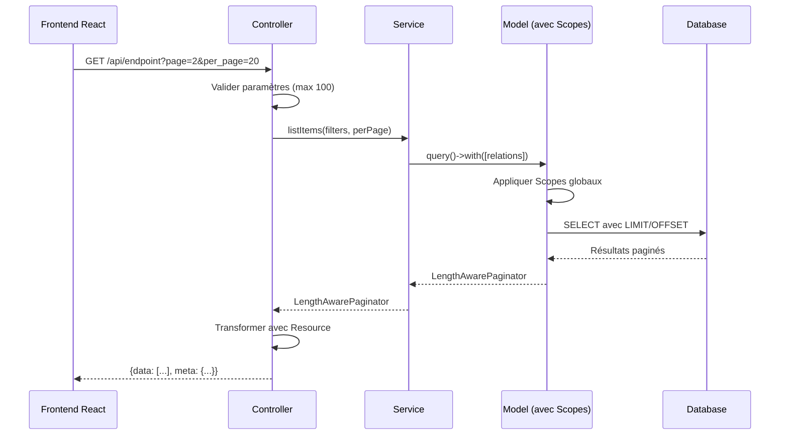

# Design Document - Implémentation de la Pagination API

## Overview

Ce document décrit le design technique pour l'implémentation d'une pagination cohérente et performante sur les endpoints de listing de l'API Laravel. L'objectif est d'améliorer les performances en évitant de charger tous les enregistrements d'un coup, tout en maintenant la compatibilité avec les scopes de sécurité existants (MultitenantScope, SchoolAccessScope, DocumentAccessScope) et en adaptant le frontend React pour gérer la pagination.

### Objectifs principaux

1. Standardiser la structure de réponse paginée sur tous les endpoints de listing
2. Maintenir la compatibilité avec les filtres et scopes de sécurité existants
3. Optimiser les performances avec eager loading et limitation des requêtes N+1
4. Adapter le frontend React pour gérer la pagination côté client
5. Garantir la sécurité multi-tenant à travers la pagination

### Endpoints concernés

- `GET /api/documents` - Liste des documents
- `GET /api/groupe-partages` - Liste des groupes de partage
- `GET /api/v1/classes` - Liste des classes
- `GET /api/v1/filieres` - Liste des filières
- `GET /api/v1/matieres` - Liste des matières

## Architecture

### Vue d'ensemble

L'architecture de pagination suit le pattern existant de l'application Laravel avec une séparation claire des responsabilités :

```
Client (React) → API Routes → Controllers → Services → Models → Database
                                                ↓
                                          Resources (transformation)
```

### Composants principaux

1. **Controllers** : Gèrent les requêtes HTTP, extraient les paramètres de pagination, appellent les services
2. **Services** : Contiennent la logique métier, appliquent les filtres et scopes, retournent des objets paginés
3. **Models** : Appliquent automatiquement les scopes globaux (MultitenantScope, SchoolAccessScope, DocumentAccessScope)
4. **Resources** : Transforment les données pour la réponse API
5. **Frontend Services** : Gèrent les appels API avec paramètres de pagination


### Flux de données



## Components and Interfaces

### 1. Structure de réponse standardisée

Tous les endpoints paginés retournent une structure JSON cohérente :

```json
{
  "data": [
    // Éléments transformés via Resource
  ],
  "meta": {
    "current_page": 1,
    "last_page": 10,
    "per_page": 15,
    "total": 150
  }
}
```

### 2. Paramètres de requête

- `page` (integer, optionnel) : Numéro de la page demandée (défaut: 1)
- `per_page` (integer, optionnel) : Nombre d'éléments par page (défaut: 15, max: 100)

### 3. Controllers

Chaque controller implémente la pagination dans sa méthode `index()` :

```php
public function index(Request $request): JsonResponse
{
    $filters = [
        // Extraction des filtres spécifiques
    ];

    // Validation et limitation de per_page
    $perPage = min($request->query('per_page', 15), 100);

    // Appel au service
    $items = $this->service->listItems($filters, $perPage);

    // Réponse standardisée
    return response()->json([
        'data' => ItemResource::collection($items->items()),
        'meta' => [
            'current_page' => $items->currentPage(),
            'last_page' => $items->lastPage(),
            'per_page' => $items->perPage(),
            'total' => $items->total(),
        ],
    ]);
}
```


### 4. Services

Les services contiennent la logique de filtrage et de pagination :

```php
public function listItems(array $filters, int $perPage = 15): LengthAwarePaginator
{
    // Eager loading pour éviter N+1
    $query = Model::query()->with([
        'relation1',
        'relation2.nestedRelation',
    ]);

    // Application des filtres
    if (isset($filters['filter1'])) {
        $query->where('column1', $filters['filter1']);
    }

    // Les scopes globaux sont appliqués automatiquement
    // MultitenantScope, SchoolAccessScope, DocumentAccessScope

    // Pagination
    return $query->orderBy('created_at', 'desc')->paginate($perPage);
}
```

### 5. Scopes de sécurité

Les scopes globaux sont appliqués automatiquement avant la pagination :

#### MultitenantScope
- SuperAdmin : Accès total
- Admin/Enseignant : Filtré par `school_id`
- Étudiant : Filtré par `school_id` + groupes activés

#### SchoolAccessScope
- Appliqué sur Filiere, Classe, Matiere
- Filtre par `ecole_id` ou `school_id` selon le modèle

#### DocumentAccessScope
- Appliqué sur Document
- Filtre par groupes de partage accessibles
- Prend en compte les préférences étudiants

### 6. Resources

Les Resources transforment les données pour la réponse API :

```php
class ItemResource extends JsonResource
{
    public function toArray($request): array
    {
        return [
            'id' => $this->id,
            'name' => $this->name,
            // Relations chargées via eager loading
            'relation' => new RelationResource($this->whenLoaded('relation')),
        ];
    }
}
```

### 7. Frontend Services (React TypeScript)

Les services frontend gèrent les appels API avec pagination :

```typescript
interface PaginationParams {
  page?: number;
  per_page?: number;
}

interface PaginatedResponse<T> {
  data: T[];
  meta: {
    current_page: number;
    last_page: number;
    per_page: number;
    total: number;
  };
}

async function fetchItems(params: PaginationParams): Promise<PaginatedResponse<Item>> {
  const response = await api.get('/api/endpoint', { params });
  return response.data;
}
```


## Data Models

### Pagination Response Structure

```typescript
interface PaginationMeta {
  current_page: number;  // Page actuelle (1-indexed)
  last_page: number;     // Dernière page disponible
  per_page: number;      // Nombre d'éléments par page
  total: number;         // Nombre total d'éléments
}

interface PaginatedResponse<T> {
  data: T[];             // Éléments transformés via Resource
  meta: PaginationMeta;  // Métadonnées de pagination
}
```

### Eloquent LengthAwarePaginator

Laravel utilise `Illuminate\Pagination\LengthAwarePaginator` qui fournit :

- `items()` : Collection des éléments de la page actuelle
- `currentPage()` : Numéro de la page actuelle
- `lastPage()` : Numéro de la dernière page
- `perPage()` : Nombre d'éléments par page
- `total()` : Nombre total d'éléments

### Modèles concernés

#### Document
- Scopes : MultitenantScope, DocumentAccessScope
- Relations : categorie, addedBy, matiere, groupesPartage
- Filtres : categorie_id, matiere_id, groupe_id, search

#### GroupePartage
- Scopes : MultitenantScope, SchoolAccessScope (logique custom)
- Relations : owner, users, documents, ecole, filiere, classe, matiere
- Filtres : type, is_public, search, filter_visible

#### Classe
- Scopes : MultitenantScope, SchoolAccessScope (via filiere)
- Relations : filiere, groupePartage, etudiants, matieres
- Filtres : filiere_id, ecole_id, search

#### Filiere
- Scopes : MultitenantScope, SchoolAccessScope
- Relations : ecole, groupePartage, classes
- Filtres : ecole_id, search

#### Matiere
- Scopes : MultitenantScope, SchoolAccessScope (via classe)
- Relations : classe, groupePartage, enseignementAssignments
- Filtres : classe_id, search


## Correctness Properties

*A property is a characteristic or behavior that should hold true across all valid executions of a system-essentially, a formal statement about what the system should do. Properties serve as the bridge between human-readable specifications and machine-verifiable correctness guarantees.*

### Property Reflection

Après analyse du prework, plusieurs propriétés peuvent être consolidées pour éviter la redondance :

- Les propriétés 3.5, 4.5, 5.5, 6.5, 7.5 (utilisation des Resources) peuvent être combinées en une seule propriété générale
- Les propriétés 3.4, 4.4, 5.4, 6.4, 7.4 (application des Scopes) peuvent être combinées avec 9.1, 9.2, 9.3
- Les propriétés 3.3, 4.3, 5.3, 6.3, 7.3 (compatibilité des filtres) peuvent être combinées en une seule propriété générale
- Les propriétés 1.2 et 1.3 (structure de réponse) peuvent être combinées en une seule propriété
- Les propriétés 11.2 et 11.3 (validation per_page) peuvent être combinées en une seule propriété

### Property 1: Structure de réponse paginée standardisée

*Pour toute* requête vers un endpoint de listing paginé, la réponse doit contenir une clé "data" avec un tableau d'éléments transformés et une clé "meta" avec les champs current_page, last_page, per_page et total.

**Validates: Requirements 1.1, 1.2, 1.3**

### Property 2: Limitation du nombre d'éléments par page

*Pour toute* requête avec un paramètre per_page supérieur à 100, la réponse doit contenir au maximum 100 éléments et meta.per_page doit être égal à 100.

**Validates: Requirements 1.5, 2.3**

### Property 3: Respect des paramètres de pagination

*Pour toute* requête avec des paramètres page et per_page valides, la réponse doit avoir meta.current_page égal au paramètre page et le nombre d'éléments dans data doit être inférieur ou égal à per_page.

**Validates: Requirements 2.1, 2.2**

### Property 4: Validation des paramètres de pagination

*Pour toute* requête avec des paramètres de pagination invalides (négatifs, non-entiers, zéro), la réponse doit utiliser les valeurs par défaut (page=1, per_page=15).

**Validates: Requirements 2.4, 2.5, 11.2, 11.3**

### Property 5: Compatibilité avec les filtres existants

*Pour toute* requête avec des filtres (categorie_id, matiere_id, groupe_id, search, type, is_public, filiere_id, ecole_id, classe_id) combinés avec la pagination, tous les éléments retournés doivent satisfaire les critères de filtrage.

**Validates: Requirements 3.3, 4.3, 5.3, 6.3, 7.3**

### Property 6: Application des scopes de sécurité avant pagination

*Pour tout* utilisateur non-SuperAdmin, les résultats paginés doivent contenir uniquement les enregistrements accessibles selon les scopes MultitenantScope, SchoolAccessScope et DocumentAccessScope applicables au modèle.

**Validates: Requirements 3.4, 4.4, 5.4, 6.4, 7.4, 9.1, 9.2, 9.3, 9.4, 9.5**

### Property 7: Transformation via Resources

*Pour tout* endpoint paginé, chaque élément dans data doit avoir la structure définie par le Resource correspondant (DocumentResource, GroupePartageResource, ClasseResource, FiliereResource, MatiereResource).

**Validates: Requirements 3.5, 4.5, 5.5, 6.5, 7.5**


### Property 8: Absence de requêtes N+1

*Pour tout* endpoint paginé, le nombre de requêtes SQL exécutées ne doit pas augmenter proportionnellement au nombre d'éléments retournés (toutes les relations doivent être chargées via eager loading).

**Validates: Requirements 10.2, 10.3**

### Property 9: Gestion des pages inexistantes

*Pour toute* requête demandant une page supérieure à last_page, la réponse doit avoir un code HTTP 200, data doit être un tableau vide, et meta doit contenir des valeurs cohérentes avec current_page égal au paramètre demandé.

**Validates: Requirements 11.1, 11.4**

### Property 10: Cohérence des métadonnées

*Pour toute* réponse paginée, les métadonnées doivent être cohérentes : current_page doit être inférieur ou égal à last_page, per_page doit être positif, et total doit être supérieur ou égal à zéro.

**Validates: Requirements 11.5**

### Property 11: Interaction frontend avec pagination

*Pour toute* action utilisateur de changement de page dans le frontend, une nouvelle requête API doit être effectuée avec le paramètre page mis à jour correspondant à la page demandée.

**Validates: Requirements 8.4**

## Error Handling

### Validation des paramètres

1. **Paramètre per_page invalide**
   - Valeurs négatives, zéro, ou non-entières → Utiliser la valeur par défaut (15)
   - Valeurs supérieures à 100 → Limiter à 100
   - Pas de message d'erreur, application silencieuse des valeurs par défaut

2. **Paramètre page invalide**
   - Valeurs négatives ou non-entières → Utiliser la valeur par défaut (1)
   - Page supérieure à last_page → Retourner une page vide avec métadonnées correctes
   - Code HTTP 200 dans tous les cas

### Gestion des erreurs de base de données

1. **Erreurs de connexion**
   - Code HTTP 500
   - Message : "Database connection error"
   - Log de l'erreur complète

2. **Erreurs de requête**
   - Code HTTP 500
   - Message : "An error occurred while fetching data"
   - Log de l'erreur SQL

### Gestion des erreurs d'autorisation

1. **Utilisateur non authentifié**
   - Code HTTP 401
   - Message : "Unauthenticated"
   - Géré par le middleware d'authentification

2. **Accès refusé par les scopes**
   - Pas d'erreur explicite
   - Retour d'une liste vide si aucun enregistrement accessible
   - Les scopes filtrent silencieusement les résultats


### Gestion des erreurs frontend

1. **Erreur réseau**
   - Afficher un message d'erreur à l'utilisateur
   - Permettre de réessayer la requête
   - Maintenir l'état de pagination précédent

2. **Réponse invalide**
   - Vérifier la présence des clés data et meta
   - Afficher un message d'erreur si la structure est invalide
   - Log de l'erreur pour le débogage

## Testing Strategy

### Approche de test duale

L'implémentation de la pagination nécessite deux types de tests complémentaires :

1. **Tests unitaires** : Vérifient des exemples spécifiques, des cas limites et des conditions d'erreur
2. **Tests basés sur les propriétés** : Vérifient les propriétés universelles sur un grand nombre d'entrées générées aléatoirement

### Tests unitaires

#### Backend (PHPUnit)

**DocumentServiceTest.php**
- Test de pagination avec valeurs par défaut
- Test de pagination avec per_page personnalisé
- Test de pagination avec filtres (categorie_id, matiere_id, groupe_id, search)
- Test d'application des scopes (MultitenantScope, DocumentAccessScope)
- Test d'eager loading des relations

**ClasseServiceTest.php**
- Test de pagination avec valeurs par défaut
- Test de pagination avec filtres (filiere_id, ecole_id, search)
- Test d'application des scopes (MultitenantScope, SchoolAccessScope)
- Test d'eager loading des relations

**MatiereServiceTest.php**
- Test de pagination avec valeurs par défaut
- Test de pagination avec filtres (classe_id, search)
- Test d'application des scopes (MultitenantScope, SchoolAccessScope)
- Test d'eager loading des relations

**FiliereServiceTest.php** (à créer)
- Test de pagination avec valeurs par défaut
- Test de pagination avec filtres (ecole_id, search)
- Test d'application des scopes (MultitenantScope, SchoolAccessScope)
- Test d'eager loading des relations

**GroupePartageServiceTest.php** (à créer)
- Test de pagination avec valeurs par défaut
- Test de pagination avec filtres (type, is_public, search, filter_visible)
- Test d'application des scopes (MultitenantScope, logique custom)
- Test d'eager loading des relations


#### Tests d'intégration (Feature Tests)

**DocumentControllerTest.php**
- Test GET /api/documents avec pagination
- Test de la structure de réponse (data + meta)
- Test de limitation per_page à 100
- Test de page inexistante (retourne page vide)
- Test de paramètres invalides (utilise valeurs par défaut)
- Test de compatibilité avec filtres existants
- Test d'autorisation (différents rôles utilisateur)

**ClasseControllerTest.php**
- Test GET /api/v1/classes avec pagination
- Test de la structure de réponse (data + meta)
- Test de limitation per_page à 100
- Test de compatibilité avec filtres existants
- Test d'autorisation (différents rôles utilisateur)

**MatiereControllerTest.php**
- Test GET /api/v1/matieres avec pagination
- Test de la structure de réponse (data + meta)
- Test de limitation per_page à 100
- Test de compatibilité avec filtres existants
- Test d'autorisation (différents rôles utilisateur)

**FiliereControllerTest.php** (à créer)
- Test GET /api/v1/filieres avec pagination
- Test de la structure de réponse (data + meta)
- Test de limitation per_page à 100
- Test de compatibilité avec filtres existants
- Test d'autorisation (différents rôles utilisateur)

**GroupePartageControllerTest.php**
- Test GET /api/groupe-partages avec pagination
- Test de la structure de réponse (data + meta)
- Test de limitation per_page à 100
- Test de compatibilité avec filtres existants
- Test d'autorisation (différents rôles utilisateur)
- Test de filter_visible pour étudiants

#### Frontend (Jest/React Testing Library)

**document.service.test.ts**
- Test d'envoi des paramètres page et per_page
- Test d'extraction des métadonnées depuis meta
- Test de gestion des erreurs réseau

**Pagination.test.tsx** (composant à créer)
- Test d'affichage des contrôles de pagination
- Test de changement de page (clic sur bouton)
- Test d'affichage de l'état de chargement
- Test de désactivation des boutons (première/dernière page)


### Tests basés sur les propriétés (Property-Based Testing)

Pour les tests basés sur les propriétés, nous utiliserons **Pest** avec le plugin **Pest Property Testing** pour PHP.

#### Configuration

```bash
composer require --dev pestphp/pest-plugin-faker
```

Chaque test de propriété doit :
- Exécuter minimum 100 itérations
- Générer des données aléatoires (utilisateurs, filtres, paramètres de pagination)
- Référencer la propriété du document de design dans un commentaire

#### Tests de propriétés

**tests/Properties/PaginationPropertiesTest.php**

```php
<?php

use App\Models\User;
use App\Models\Document;

/**
 * Feature: api-pagination-implementation, Property 1: Structure de réponse paginée standardisée
 */
it('returns standardized pagination response structure for all listing endpoints', function () {
    // Générer utilisateur aléatoire
    $user = User::factory()->create();
    
    // Tester chaque endpoint
    $endpoints = [
        '/api/documents',
        '/api/groupe-partages',
        '/api/v1/classes',
        '/api/v1/filieres',
        '/api/v1/matieres',
    ];
    
    foreach ($endpoints as $endpoint) {
        $response = $this->actingAs($user)->getJson($endpoint);
        
        $response->assertOk()
            ->assertJsonStructure([
                'data',
                'meta' => [
                    'current_page',
                    'last_page',
                    'per_page',
                    'total',
                ],
            ]);
    }
})->repeat(100);

/**
 * Feature: api-pagination-implementation, Property 2: Limitation du nombre d'éléments par page
 */
it('limits per_page to maximum 100 items', function () {
    $user = User::factory()->create();
    $perPage = fake()->numberBetween(101, 1000);
    
    $response = $this->actingAs($user)
        ->getJson("/api/documents?per_page={$perPage}");
    
    $response->assertOk();
    expect($response->json('meta.per_page'))->toBeLessThanOrEqual(100);
    expect(count($response->json('data')))->toBeLessThanOrEqual(100);
})->repeat(100);

/**
 * Feature: api-pagination-implementation, Property 3: Respect des paramètres de pagination
 */
it('respects page and per_page parameters', function () {
    $user = User::factory()->create();
    Document::factory()->count(50)->create();
    
    $page = fake()->numberBetween(1, 5);
    $perPage = fake()->numberBetween(5, 20);
    
    $response = $this->actingAs($user)
        ->getJson("/api/documents?page={$page}&per_page={$perPage}");
    
    $response->assertOk();
    expect($response->json('meta.current_page'))->toBe($page);
    expect($response->json('meta.per_page'))->toBe($perPage);
    expect(count($response->json('data')))->toBeLessThanOrEqual($perPage);
})->repeat(100);
```


```php
/**
 * Feature: api-pagination-implementation, Property 4: Validation des paramètres de pagination
 */
it('uses default values for invalid pagination parameters', function () {
    $user = User::factory()->create();
    
    // Tester différents paramètres invalides
    $invalidParams = [
        'per_page=-10',
        'per_page=0',
        'per_page=abc',
        'page=-1',
        'page=xyz',
    ];
    
    foreach ($invalidParams as $param) {
        $response = $this->actingAs($user)
            ->getJson("/api/documents?{$param}");
        
        $response->assertOk();
        // Doit utiliser les valeurs par défaut
        expect($response->json('meta.per_page'))->toBeGreaterThan(0);
        expect($response->json('meta.current_page'))->toBeGreaterThan(0);
    }
})->repeat(100);

/**
 * Feature: api-pagination-implementation, Property 5: Compatibilité avec les filtres existants
 */
it('maintains filter compatibility with pagination', function () {
    $user = User::factory()->create();
    
    // Créer des documents avec différentes catégories
    $category = \App\Models\DocumentCategory::factory()->create();
    Document::factory()->count(10)->create(['categorie_id' => $category->id]);
    Document::factory()->count(10)->create(); // Autres catégories
    
    $response = $this->actingAs($user)
        ->getJson("/api/documents?categorie_id={$category->id}&per_page=5");
    
    $response->assertOk();
    
    // Tous les documents retournés doivent avoir la bonne catégorie
    foreach ($response->json('data') as $document) {
        expect($document['categorie']['id'])->toBe($category->id);
    }
})->repeat(100);

/**
 * Feature: api-pagination-implementation, Property 6: Application des scopes de sécurité avant pagination
 */
it('applies security scopes before pagination', function () {
    // Créer deux écoles différentes
    $school1 = \App\Models\Ecole::factory()->create();
    $school2 = \App\Models\Ecole::factory()->create();
    
    // Créer un utilisateur admin de school1
    $user = User::factory()->create([
        'school_id' => $school1->id,
        'role' => 'admin',
    ]);
    
    // Créer des classes dans les deux écoles
    $filiere1 = \App\Models\Filiere::factory()->create(['ecole_id' => $school1->id]);
    $filiere2 = \App\Models\Filiere::factory()->create(['ecole_id' => $school2->id]);
    
    \App\Models\Classe::factory()->count(5)->create(['filiere_id' => $filiere1->id]);
    \App\Models\Classe::factory()->count(5)->create(['filiere_id' => $filiere2->id]);
    
    $response = $this->actingAs($user)->getJson('/api/v1/classes');
    
    $response->assertOk();
    
    // L'utilisateur ne doit voir que les classes de son école
    foreach ($response->json('data') as $classe) {
        expect($classe['filiere']['ecole_id'])->toBe($school1->id);
    }
})->repeat(100);
```


```php
/**
 * Feature: api-pagination-implementation, Property 8: Absence de requêtes N+1
 */
it('avoids N+1 queries with eager loading', function () {
    $user = User::factory()->create();
    
    // Créer plusieurs documents avec relations
    Document::factory()->count(20)->create();
    
    // Compter les requêtes SQL
    \DB::enableQueryLog();
    
    $response = $this->actingAs($user)
        ->getJson('/api/documents?per_page=20');
    
    $queryCount = count(\DB::getQueryLog());
    \DB::disableQueryLog();
    
    $response->assertOk();
    
    // Le nombre de requêtes ne doit pas dépendre du nombre d'éléments
    // Devrait être constant (environ 2-3 requêtes : count + select avec joins)
    expect($queryCount)->toBeLessThan(10);
})->repeat(100);

/**
 * Feature: api-pagination-implementation, Property 9: Gestion des pages inexistantes
 */
it('returns empty page with correct metadata for non-existent pages', function () {
    $user = User::factory()->create();
    Document::factory()->count(10)->create();
    
    // Demander une page qui n'existe pas
    $response = $this->actingAs($user)
        ->getJson('/api/documents?page=999&per_page=10');
    
    $response->assertOk();
    expect($response->json('data'))->toBeArray()->toBeEmpty();
    expect($response->json('meta.current_page'))->toBe(999);
    expect($response->json('meta.last_page'))->toBeLessThan(999);
})->repeat(100);

/**
 * Feature: api-pagination-implementation, Property 10: Cohérence des métadonnées
 */
it('returns consistent pagination metadata', function () {
    $user = User::factory()->create();
    Document::factory()->count(50)->create();
    
    $page = fake()->numberBetween(1, 5);
    $perPage = fake()->numberBetween(5, 20);
    
    $response = $this->actingAs($user)
        ->getJson("/api/documents?page={$page}&per_page={$perPage}");
    
    $response->assertOk();
    
    $meta = $response->json('meta');
    
    // Vérifier la cohérence
    expect($meta['current_page'])->toBeLessThanOrEqual($meta['last_page']);
    expect($meta['per_page'])->toBeGreaterThan(0);
    expect($meta['total'])->toBeGreaterThanOrEqual(0);
    
    // Vérifier la formule : last_page = ceil(total / per_page)
    $expectedLastPage = (int) ceil($meta['total'] / $meta['per_page']);
    expect($meta['last_page'])->toBe($expectedLastPage);
})->repeat(100);
```


### Tests de performance

**tests/Performance/PaginationPerformanceTest.php**

```php
<?php

/**
 * Feature: api-pagination-implementation, Property 10.5: Performance avec grands volumes
 */
it('returns results in less than 500ms with over 1000 records', function () {
    $user = User::factory()->create();
    
    // Créer un grand nombre d'enregistrements
    Document::factory()->count(1500)->create();
    
    $startTime = microtime(true);
    
    $response = $this->actingAs($user)
        ->getJson('/api/documents?per_page=50');
    
    $endTime = microtime(true);
    $duration = ($endTime - $startTime) * 1000; // en millisecondes
    
    $response->assertOk();
    expect($duration)->toBeLessThan(500);
})->repeat(10);
```

### Stratégie d'exécution des tests

1. **Tests unitaires** : Exécutés à chaque commit (CI/CD)
2. **Tests d'intégration** : Exécutés à chaque commit (CI/CD)
3. **Tests de propriétés** : Exécutés quotidiennement (nightly builds) en raison du nombre d'itérations
4. **Tests de performance** : Exécutés avant chaque release

### Couverture de code

Objectif : 90% de couverture pour les services et controllers implémentant la pagination

```bash
# Générer le rapport de couverture
php artisan test --coverage --min=90
```

## Considérations de performance

### 1. Eager Loading

Toutes les relations nécessaires doivent être chargées via `with()` pour éviter les requêtes N+1 :

```php
$query = Model::query()->with([
    'relation1',
    'relation2.nestedRelation',
    'relation3',
]);
```

### 2. Index de base de données

Les colonnes utilisées pour le tri et le filtrage doivent avoir des index :

```php
// Migration
Schema::table('documents', function (Blueprint $table) {
    $table->index('categorie_id');
    $table->index('matiere_id');
    $table->index('created_at');
});
```

### 3. Limitation de per_page

La limitation à 100 éléments par page évite :
- Surcharge mémoire côté serveur
- Temps de réponse trop longs
- Surcharge réseau
- Problèmes de performance frontend


### 4. Optimisation des requêtes

#### Utilisation de select() pour limiter les colonnes

```php
$query->select([
    'id',
    'name',
    'created_at',
    // Seulement les colonnes nécessaires
]);
```

#### Utilisation de cursor() pour les très grands ensembles

Pour les exports ou traitements batch (hors pagination API) :

```php
foreach (Model::cursor() as $item) {
    // Traitement
}
```

### 5. Cache des métadonnées

Pour les listes très fréquemment consultées, envisager de cacher le total :

```php
$total = Cache::remember("documents_total_{$userId}", 300, function () use ($query) {
    return $query->count();
});
```

### 6. Monitoring des performances

Utiliser Laravel Telescope ou un APM pour surveiller :
- Temps de réponse des endpoints paginés
- Nombre de requêtes SQL par endpoint
- Utilisation mémoire
- Temps d'exécution des requêtes lentes

## Considérations de sécurité

### 1. Application automatique des scopes

Les scopes globaux garantissent l'isolation multi-tenant :

```php
// MultitenantScope appliqué automatiquement
$documents = Document::paginate(15);
// L'utilisateur ne voit que les documents de son école
```

### 2. Validation des paramètres

Les paramètres de pagination sont validés et limités :

```php
$perPage = min($request->query('per_page', 15), 100);
$page = max(1, (int) $request->query('page', 1));
```

### 3. Protection contre les injections

Laravel Eloquent protège automatiquement contre les injections SQL via les paramètres bindés.

### 4. Rate Limiting

Appliquer un rate limiting sur les endpoints paginés pour éviter les abus :

```php
// routes/api.php
Route::middleware(['auth:sanctum', 'throttle:60,1'])->group(function () {
    Route::get('/documents', [DocumentController::class, 'index']);
});
```

### 5. Autorisation par rôle

Les scopes appliquent automatiquement les règles d'autorisation :
- SuperAdmin : Accès total
- Admin : Données de son école
- Enseignant : Données de son école
- Étudiant : Données de son école + groupes activés


## Implémentation Frontend

### 1. Service API générique

Créer un service générique pour gérer la pagination :

```typescript
// src/services/paginatedApi.service.ts
import api from './api';

export interface PaginationParams {
  page?: number;
  per_page?: number;
  [key: string]: any; // Autres filtres
}

export interface PaginationMeta {
  current_page: number;
  last_page: number;
  per_page: number;
  total: number;
}

export interface PaginatedResponse<T> {
  data: T[];
  meta: PaginationMeta;
}

export async function fetchPaginated<T>(
  endpoint: string,
  params: PaginationParams = {}
): Promise<PaginatedResponse<T>> {
  const response = await api.get(endpoint, { params });
  return response.data;
}
```

### 2. Hook React personnalisé

Créer un hook pour gérer l'état de pagination :

```typescript
// src/hooks/usePagination.ts
import { useState, useCallback } from 'react';
import { PaginationParams, PaginationMeta } from '../services/paginatedApi.service';

export function usePagination(initialPerPage: number = 15) {
  const [page, setPage] = useState(1);
  const [perPage, setPerPage] = useState(initialPerPage);
  const [meta, setMeta] = useState<PaginationMeta | null>(null);
  const [loading, setLoading] = useState(false);

  const updateMeta = useCallback((newMeta: PaginationMeta) => {
    setMeta(newMeta);
  }, []);

  const nextPage = useCallback(() => {
    if (meta && page < meta.last_page) {
      setPage(page + 1);
    }
  }, [page, meta]);

  const prevPage = useCallback(() => {
    if (page > 1) {
      setPage(page - 1);
    }
  }, [page]);

  const goToPage = useCallback((newPage: number) => {
    if (meta && newPage >= 1 && newPage <= meta.last_page) {
      setPage(newPage);
    }
  }, [meta]);

  const params: PaginationParams = {
    page,
    per_page: perPage,
  };

  return {
    page,
    perPage,
    meta,
    loading,
    setLoading,
    updateMeta,
    nextPage,
    prevPage,
    goToPage,
    setPerPage,
    params,
  };
}
```


### 3. Composant Pagination

Créer un composant réutilisable pour les contrôles de pagination :

```typescript
// src/components/Pagination.tsx
import React from 'react';
import { PaginationMeta } from '../services/paginatedApi.service';

interface PaginationProps {
  meta: PaginationMeta;
  onPageChange: (page: number) => void;
  loading?: boolean;
}

export const Pagination: React.FC<PaginationProps> = ({
  meta,
  onPageChange,
  loading = false,
}) => {
  const { current_page, last_page, total, per_page } = meta;

  const handlePrevious = () => {
    if (current_page > 1) {
      onPageChange(current_page - 1);
    }
  };

  const handleNext = () => {
    if (current_page < last_page) {
      onPageChange(current_page + 1);
    }
  };

  return (
    <div className="pagination">
      <button
        onClick={handlePrevious}
        disabled={current_page === 1 || loading}
        className="pagination-btn"
      >
        Précédent
      </button>

      <span className="pagination-info">
        Page {current_page} sur {last_page} ({total} éléments)
      </span>

      <button
        onClick={handleNext}
        disabled={current_page === last_page || loading}
        className="pagination-btn"
      >
        Suivant
      </button>
    </div>
  );
};
```

### 4. Exemple d'utilisation

```typescript
// src/pages/Documents.tsx
import React, { useEffect, useState } from 'react';
import { usePagination } from '../hooks/usePagination';
import { fetchPaginated } from '../services/paginatedApi.service';
import { Pagination } from '../components/Pagination';

interface Document {
  id: string;
  document_name: string;
  // ...
}

export const Documents: React.FC = () => {
  const [documents, setDocuments] = useState<Document[]>([]);
  const pagination = usePagination(15);

  useEffect(() => {
    const loadDocuments = async () => {
      pagination.setLoading(true);
      try {
        const response = await fetchPaginated<Document>(
          '/api/documents',
          pagination.params
        );
        setDocuments(response.data);
        pagination.updateMeta(response.meta);
      } catch (error) {
        console.error('Error loading documents:', error);
      } finally {
        pagination.setLoading(false);
      }
    };

    loadDocuments();
  }, [pagination.page, pagination.perPage]);

  return (
    <div>
      <h1>Documents</h1>
      
      {pagination.loading ? (
        <div>Chargement...</div>
      ) : (
        <>
          <div className="documents-list">
            {documents.map((doc) => (
              <div key={doc.id}>{doc.document_name}</div>
            ))}
          </div>

          {pagination.meta && (
            <Pagination
              meta={pagination.meta}
              onPageChange={pagination.goToPage}
              loading={pagination.loading}
            />
          )}
        </>
      )}
    </div>
  );
};
```


## Migration et déploiement

### Phase 1 : Backend (Semaine 1)

1. **Jour 1-2 : DocumentController et DocumentService**
   - Modifier `DocumentController::index()` pour retourner la structure paginée
   - `DocumentService::getUserAccessibleDocuments()` retourne déjà un `LengthAwarePaginator`
   - Ajouter tests unitaires et d'intégration
   - Vérifier l'eager loading des relations

2. **Jour 3 : GroupePartageController**
   - Modifier `GroupePartageController::index()` pour retourner la structure paginée
   - Créer `GroupePartageService::listGroupes()` si nécessaire
   - Ajouter tests unitaires et d'intégration
   - Vérifier l'eager loading des relations

3. **Jour 4 : ClasseController et ClasseService**
   - `ClasseController::index()` et `ClasseService::listClasses()` implémentent déjà la pagination
   - Vérifier la structure de réponse (ajouter clé "data" si nécessaire)
   - Compléter les tests

4. **Jour 5 : MatiereController et MatiereService**
   - `MatiereController::index()` et `MatiereService::listMatieres()` implémentent déjà la pagination
   - Vérifier la structure de réponse (ajouter clé "data" si nécessaire)
   - Compléter les tests

### Phase 2 : FiliereController (Semaine 2, Jour 1-2)

1. Créer `FiliereController` avec méthode `index()`
2. Créer `FiliereService` avec méthode `listFilieres()`
3. Ajouter routes API
4. Ajouter tests unitaires et d'intégration

### Phase 3 : Frontend (Semaine 2, Jour 3-5)

1. **Jour 3 : Services et hooks**
   - Créer `paginatedApi.service.ts`
   - Créer hook `usePagination`
   - Créer composant `Pagination`

2. **Jour 4 : Adaptation des pages existantes**
   - Adapter `Documents.tsx`
   - Adapter `Matieres.tsx`
   - Adapter `Classes.tsx`

3. **Jour 5 : Tests et finalisation**
   - Ajouter tests Jest pour les services
   - Ajouter tests React Testing Library pour les composants
   - Tests d'intégration end-to-end

### Phase 4 : Tests de propriétés et performance (Semaine 3)

1. **Jour 1-2 : Tests de propriétés**
   - Installer Pest Property Testing
   - Implémenter les 11 tests de propriétés
   - Exécuter et corriger les bugs découverts

2. **Jour 3 : Tests de performance**
   - Créer un jeu de données de test (1500+ enregistrements)
   - Exécuter les tests de performance
   - Optimiser si nécessaire (index, eager loading)

3. **Jour 4-5 : Documentation et revue**
   - Mettre à jour la documentation API
   - Revue de code
   - Préparation du déploiement


### Stratégie de déploiement

1. **Déploiement progressif (Canary)**
   - Déployer d'abord sur un environnement de staging
   - Tester avec un sous-ensemble d'utilisateurs
   - Surveiller les métriques de performance
   - Déployer en production si tout est OK

2. **Rollback plan**
   - Garder l'ancienne version disponible
   - Possibilité de rollback immédiat si problème
   - Monitoring actif pendant 48h après déploiement

3. **Communication**
   - Informer les utilisateurs des améliorations de performance
   - Documenter les changements dans l'API
   - Former l'équipe de support

## Risques et mitigation

### Risque 1 : Régression des fonctionnalités existantes

**Impact** : Élevé  
**Probabilité** : Moyenne

**Mitigation** :
- Tests d'intégration complets avant déploiement
- Tests de régression sur tous les endpoints
- Revue de code approfondie
- Déploiement progressif avec monitoring

### Risque 2 : Performance dégradée avec grands volumes

**Impact** : Élevé  
**Probabilité** : Faible

**Mitigation** :
- Tests de performance avec jeux de données réalistes
- Monitoring des temps de réponse en production
- Index de base de données sur colonnes critiques
- Eager loading systématique des relations

### Risque 3 : Problèmes de sécurité (fuite de données)

**Impact** : Critique  
**Probabilité** : Faible

**Mitigation** :
- Tests approfondis des scopes de sécurité
- Tests avec différents rôles utilisateur
- Revue de sécurité par un expert
- Audit des logs d'accès après déploiement

### Risque 4 : Incompatibilité frontend

**Impact** : Moyen  
**Probabilité** : Faible

**Mitigation** :
- Tests end-to-end complets
- Tests sur différents navigateurs
- Tests de compatibilité avec anciennes versions
- Documentation claire des changements API

### Risque 5 : Surcharge serveur lors du déploiement

**Impact** : Moyen  
**Probabilité** : Faible

**Mitigation** :
- Déploiement en heures creuses
- Monitoring actif des ressources serveur
- Plan de scaling horizontal si nécessaire
- Cache des requêtes fréquentes


## Métriques de succès

### Métriques de performance

1. **Temps de réponse API**
   - Objectif : < 200ms pour 95% des requêtes
   - Mesure : APM (Application Performance Monitoring)

2. **Nombre de requêtes SQL**
   - Objectif : < 5 requêtes par endpoint paginé
   - Mesure : Laravel Telescope / Query logging

3. **Utilisation mémoire**
   - Objectif : < 50MB par requête
   - Mesure : Monitoring serveur

4. **Temps de chargement frontend**
   - Objectif : < 1s pour afficher la première page
   - Mesure : Google Lighthouse / Web Vitals

### Métriques de qualité

1. **Couverture de tests**
   - Objectif : > 90% pour les services et controllers
   - Mesure : PHPUnit coverage report

2. **Nombre de bugs en production**
   - Objectif : 0 bug critique dans les 2 premières semaines
   - Mesure : Système de ticketing

3. **Satisfaction utilisateur**
   - Objectif : > 4/5 sur les retours utilisateurs
   - Mesure : Enquête de satisfaction

### Métriques d'adoption

1. **Utilisation de la pagination**
   - Objectif : 100% des endpoints de listing utilisent la pagination
   - Mesure : Audit de code

2. **Réduction de la charge serveur**
   - Objectif : -30% de bande passante utilisée
   - Mesure : Monitoring réseau

## Conclusion

L'implémentation de la pagination API est une amélioration critique pour les performances et l'expérience utilisateur de l'application. Le design proposé :

1. **Standardise** la structure de réponse sur tous les endpoints
2. **Maintient** la compatibilité avec les filtres et scopes de sécurité existants
3. **Optimise** les performances avec eager loading et limitation des requêtes
4. **Sécurise** l'accès aux données via les scopes multi-tenant
5. **Facilite** l'utilisation côté frontend avec des composants réutilisables

Le plan de migration progressif et les tests approfondis (unitaires, intégration, propriétés, performance) garantissent une implémentation fiable et sans régression.

