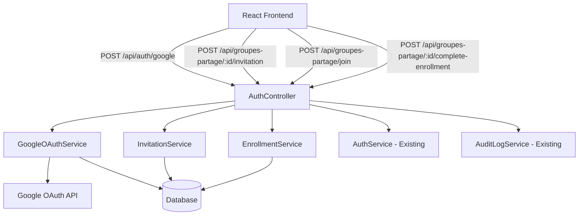
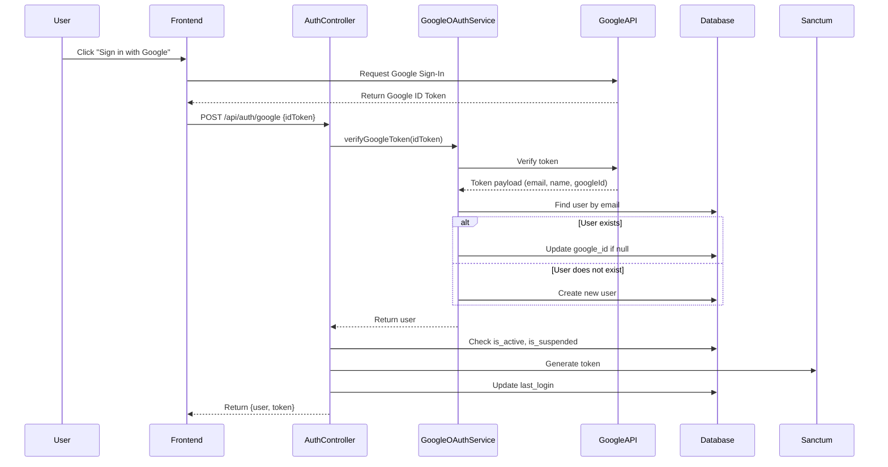
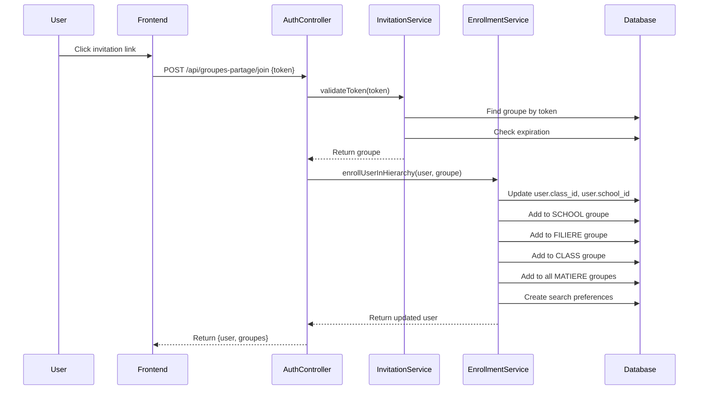
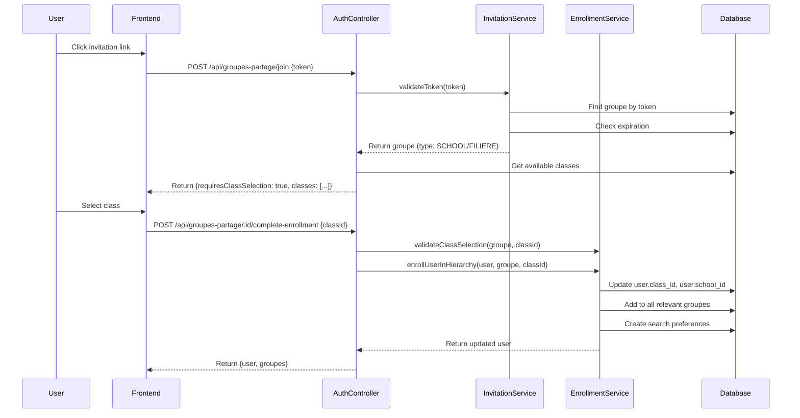

# Design Document: Google OAuth Authentication and Invitation Signup

## Overview

This design document outlines the implementation of two authentication features for the Laravel backend:

1. **Google OAuth Authentication**: Allow users to authenticate using their Google account
2. **Invitation-based Signup**: Allow users to join sharing groups via invitation tokens with automatic hierarchical enrollment

The implementation follows Laravel best practices and integrates seamlessly with the existing architecture (Services, Controllers, FormRequests, Resources, Middleware). The design ensures compatibility with the React frontend and maintains consistency with the existing Node.js implementation.

### Key Design Principles

- **Service-Oriented Architecture**: Business logic encapsulated in dedicated services
- **Single Responsibility**: Each service handles one specific domain
- **Transaction Safety**: Database operations wrapped in transactions
- **Audit Logging**: All critical operations logged for traceability
- **Security First**: Token validation, permission checks, and input sanitization
- **Frontend Compatibility**: API responses match existing frontend expectations

## Architecture

### High-Level Component Diagram




### Request Flow Diagrams

#### Google OAuth Authentication Flow



#### Invitation Join Flow (CLASS/MATIERE)




#### Invitation Join Flow (SCHOOL/FILIERE with Class Selection)



## Components and Interfaces

### 1. GoogleOAuthService

**Responsibility**: Verify Google ID Tokens and manage Google authentication

**Dependencies**:
- `Google\Client` (google/apiclient package)
- `AuditLogService`
- `User` model

**Public Methods**:

```php
class GoogleOAuthService
{
    /**
     * Verify Google ID Token and return user payload
     * 
     * @param string $idToken Google ID Token from frontend
     * @return array User payload [email, given_name, family_name, sub (googleId)]
     * @throws \Exception if token is invalid
     */
    public function verifyGoogleToken(string $idToken): array;
    
    /**
     * Find or create user from Google payload
     * 
     * @param array $payload Google user payload
     * @return User User instance
     */
    public function findOrCreateUser(array $payload): User;
}
```


**Implementation Details**:

- Use `Google\Client` library to verify tokens
- Configure Google Client ID from environment variable `GOOGLE_CLIENT_ID`
- Extract user information from verified token payload
- Create new users with default values:
  - `role`: 'student'
  - `is_active`: true
  - `is_verified`: true (email verified by Google)
- Update existing users' `google_id` if null
- Log all authentication events via AuditLogService

### 2. InvitationService

**Responsibility**: Manage invitation token generation, validation, and group joining

**Dependencies**:
- `GroupePartage` model
- `User` model
- `AuditLogService`

**Public Methods**:

```php
class InvitationService
{
    /**
     * Generate invitation token for a groupe
     * 
     * @param GroupePartage $groupe
     * @return string Generated token
     */
    public function generateInvitationToken(GroupePartage $groupe): string;
    
    /**
     * Validate invitation token and return groupe
     * 
     * @param string $token Invitation token
     * @return GroupePartage
     * @throws \Illuminate\Database\Eloquent\ModelNotFoundException if invalid
     * @throws \Exception if expired
     */
    public function validateInvitationToken(string $token): GroupePartage;
    
    /**
     * Add user to groupe (for CUSTOM type)
     * 
     * @param GroupePartage $groupe
     * @param User $user
     * @return void
     */
    public function addUserToGroupe(GroupePartage $groupe, User $user): void;
}
```

**Implementation Details**:

- Generate cryptographically secure random tokens using `Str::random(64)`
- Set expiration to 7 days from generation
- Validate token existence and expiration before allowing join
- For CUSTOM groupes, simply add user to groupe_partage_users pivot table
- For hierarchical groupes (SCHOOL, FILIERE, CLASS, MATIERE), delegate to EnrollmentService
- Log all invitation generation and usage events


### 3. EnrollmentService

**Responsibility**: Handle hierarchical enrollment of users in educational structure

**Dependencies**:
- `User` model
- `GroupePartage` model
- `Classe` model
- `Filiere` model
- `Ecole` model
- `Matiere` model
- `UserSearchPreference` model
- `AutoGroupEnrollmentService` (existing)
- `AuditLogService`

**Public Methods**:

```php
class EnrollmentService
{
    /**
     * Enroll user in complete hierarchy based on groupe type
     * 
     * @param User $user
     * @param GroupePartage $groupe
     * @param string|null $classId Required for SCHOOL/FILIERE groupes
     * @return User Updated user with relationships
     */
    public function enrollUserInHierarchy(User $user, GroupePartage $groupe, ?string $classId = null): User;
    
    /**
     * Get available classes for a groupe
     * 
     * @param GroupePartage $groupe
     * @return \Illuminate\Support\Collection Collection of classes
     */
    public function getAvailableClasses(GroupePartage $groupe): \Illuminate\Support\Collection;
    
    /**
     * Validate class selection for a groupe
     * 
     * @param GroupePartage $groupe
     * @param string $classId
     * @return bool
     */
    public function validateClassSelection(GroupePartage $groupe, string $classId): bool;
    
    /**
     * Create default search preferences for user
     * 
     * @param User $user
     * @return void
     */
    public function createDefaultSearchPreferences(User $user): void;
}
```

**Implementation Details**:

**Enrollment Logic by Groupe Type**:

1. **CLASS Groupe**:
   - Update `user.class_id` with classe ID
   - Update `user.school_id` with école ID from classe hierarchy
   - Add user to SCHOOL groupe (via école)
   - Add user to FILIERE groupe (via classe.filiere)
   - Add user to CLASS groupe
   - Add user to all MATIERE groupes for that classe
   - Create default search preferences

2. **MATIERE Groupe**:
   - Same as CLASS groupe (enroll in complete hierarchy)

3. **FILIERE Groupe**:
   - Return list of classes in that filière
   - Wait for user to select class
   - Then perform CLASS enrollment

4. **SCHOOL Groupe**:
   - Return list of all classes in that école
   - Wait for user to select class
   - Then perform CLASS enrollment

5. **CUSTOM Groupe**:
   - Simply add user to groupe (no hierarchy)


**Search Preferences Creation**:

- Create `UserSearchPreference` with `preference_type = 'search_settings'`
- Set `preference_value` as JSON:
  ```json
  {
    "preferred_groupe_ids": ["groupe_id_1", "groupe_id_2", ...],
    "is_default": true
  }
  ```
- Include all groupe IDs the user is now member of
- If preference already exists, update it instead of creating duplicate

**Transaction Safety**:

- All enrollment operations wrapped in database transaction
- Rollback on any failure to maintain data consistency

### 4. AuthController Extensions

**New Endpoints**:

```php
/**
 * Authenticate user with Google OAuth
 * POST /api/auth/google
 * 
 * @param GoogleAuthRequest $request
 * @return JsonResponse
 */
public function googleAuth(GoogleAuthRequest $request): JsonResponse;

/**
 * Generate invitation token for groupe
 * POST /api/groupes-partage/{groupePartage}/invitation
 * 
 * @param GroupePartage $groupePartage
 * @return JsonResponse
 */
public function generateInvitation(GroupePartage $groupePartage): JsonResponse;

/**
 * Join groupe via invitation token
 * POST /api/groupes-partage/join
 * 
 * @param JoinGroupeRequest $request
 * @return JsonResponse
 */
public function joinViaInvitation(JoinGroupeRequest $request): JsonResponse;

/**
 * Complete enrollment with class selection
 * POST /api/groupes-partage/{groupePartage}/complete-enrollment
 * 
 * @param CompleteEnrollmentRequest $request
 * @param GroupePartage $groupePartage
 * @return JsonResponse
 */
public function completeEnrollment(CompleteEnrollmentRequest $request, GroupePartage $groupePartage): JsonResponse;
```

**Response Formats**:

Google Auth Success:
```json
{
  "success": true,
  "user": {
    "id": "uuid",
    "email": "user@example.com",
    "first_name": "John",
    "last_name": "Doe",
    "google_id": "google_user_id",
    "role": "student",
    "school": {...},
    "classe": {...},
    "groupesPartage": [...]
  },
  "token": "sanctum_token"
}
```

Join Invitation (requires class selection):
```json
{
  "requiresClassSelection": true,
  "groupe": {...},
  "classes": [
    {
      "id": "uuid",
      "classe_name": "Terminale S1",
      "filiere": {
        "filiere_name": "Scientifique"
      },
      "ecole": {
        "ecole_name": "Lycée Example"
      }
    }
  ]
}
```


Join Invitation (automatic enrollment):
```json
{
  "success": true,
  "message": "Successfully joined groupe and enrolled in hierarchy",
  "user": {
    "id": "uuid",
    "class_id": "uuid",
    "school_id": "uuid",
    "groupesPartage": [...]
  }
}
```

## Data Models

### User Model Extensions

**New/Updated Fields**:
- `google_id` (string, nullable, unique): Google user ID
- `is_verified` (boolean, default false): Email verification status

**Relationships** (existing, used by new features):
- `school()`: BelongsTo Ecole
- `classe()`: BelongsTo Classe
- `groupesPartage()`: BelongsToMany GroupePartage
- `searchPreferences()`: HasMany UserSearchPreference

### GroupePartage Model Extensions

**Existing Fields Used**:
- `invitation_token` (string, nullable): Invitation token
- `invitation_expires_at` (timestamp, nullable): Token expiration
- `type` (enum): school, filiere, class, matiere, custom
- `ecole_id` (uuid, nullable): For SCHOOL type
- `filiere_id` (uuid, nullable): For FILIERE type
- `classe_id` (uuid, nullable): For CLASS type
- `matiere_id` (uuid, nullable): For MATIERE type

**Relationships** (existing):
- `ecole()`: BelongsTo Ecole
- `filiere()`: BelongsTo Filiere
- `classe()`: BelongsTo Classe
- `matiere()`: BelongsTo Matiere
- `users()`: BelongsToMany User

### UserSearchPreference Model

**Fields**:
- `id` (uuid, primary)
- `user_id` (uuid, foreign key to users)
- `preference_type` (string): 'search_settings'
- `preference_value` (json): Contains preferred_groupe_ids array
- `is_default` (boolean): Whether this is the default preference
- `created_at`, `updated_at` (timestamps)

**Structure of preference_value**:
```json
{
  "preferred_groupe_ids": ["uuid1", "uuid2", "uuid3"],
  "is_default": true
}
```


## Correctness Properties

A property is a characteristic or behavior that should hold true across all valid executions of a system—essentially, a formal statement about what the system should do. Properties serve as the bridge between human-readable specifications and machine-verifiable correctness guarantees.

### Property Reflection

After analyzing all acceptance criteria, several properties can be consolidated to avoid redundancy:

**Consolidated Properties**:
- Properties 1.5, 1.6, and 1.9 can be combined into a single "Google auth success response" property
- Properties 4.1, 4.2, 4.3, 4.4, 4.5 can be combined into a single "Complete hierarchical enrollment" property
- Properties 6.5, 6.6, 6.7, 6.8 duplicate the hierarchical enrollment logic and can reference the same property
- Properties 2.2 and 2.3 can be combined into a single "Token generation and storage" property
- Properties 7.1, 7.2, 7.3 can be combined into a single "Search preferences creation" property

### Google OAuth Authentication Properties

Property 1: Google token verification
*For any* valid Google ID Token, verifying it should return a payload containing email, given_name, family_name, and sub (Google ID)
**Validates: Requirements 1.1**

Property 2: Invalid token rejection
*For any* invalid or expired Google ID Token, verification should fail with status 401 and error code "INVALID_TOKEN"
**Validates: Requirements 1.2**

Property 3: New user creation from Google
*For any* verified Google user payload where no user exists with that email, a new user should be created with email, first_name, last_name, google_id, role="student", is_active=true, and is_verified=true
**Validates: Requirements 1.3, 9.7**

Property 4: Existing user Google ID update
*For any* verified Google user payload where a user exists with that email and google_id is null, the user's google_id field should be updated
**Validates: Requirements 1.4**

Property 5: Suspended account rejection
*For any* Google user with is_suspended=true, authentication should fail with status 403 and error code "ACCOUNT_SUSPENDED"
**Validates: Requirements 1.7**

Property 6: Inactive account rejection
*For any* Google user with is_active=false, authentication should fail with status 403 and error code "ACCOUNT_DISABLED"
**Validates: Requirements 1.8**

Property 7: Google auth success response
*For any* successful Google authentication, the response should contain a user object with all relationships (school, classe, groupesPartage), a Sanctum token, and the user's last_login should be updated to the current timestamp
**Validates: Requirements 1.5, 1.6, 1.9**


### Invitation Token Generation Properties

Property 8: Token generation and storage
*For any* groupe where an authorized user generates an invitation token, a unique 64-character token should be generated, stored in invitation_token field, and invitation_expires_at should be set to exactly 7 days from generation
**Validates: Requirements 2.1, 2.2, 2.3**

Property 9: Token generation authorization
*For any* user who is not the owner, admin, or superadmin attempting to generate an invitation token, the request should fail with status 403 and error code "INSUFFICIENT_PERMISSIONS"
**Validates: Requirements 2.4**

Property 10: Token generation response format
*For any* successful invitation token generation, the response should contain the token and expiration timestamp in ISO 8601 format
**Validates: Requirements 2.5**

Property 11: Token uniqueness
*For any* two invitation token generations, the generated tokens should be different (cryptographically secure randomness)
**Validates: Requirements 9.2**

### Invitation Join Properties

Property 12: Token validation and lookup
*For any* valid invitation token, the service should find and return the corresponding groupe
**Validates: Requirements 3.1**

Property 13: Invalid token rejection
*For any* invitation token that does not match any groupe, the request should fail with status 404 and error code "INVALID_TOKEN"
**Validates: Requirements 3.2**

Property 14: Expired token rejection
*For any* invitation token where invitation_expires_at is less than the current timestamp, the request should fail with status 400 and error code "TOKEN_EXPIRED"
**Validates: Requirements 3.3**

Property 15: CUSTOM groupe simple join
*For any* valid invitation token for a CUSTOM type groupe, the user should be added to the groupe members via a pivot record in groupe_partage_users
**Validates: Requirements 3.6, 3.7**

Property 16: FILIERE/SCHOOL class selection response
*For any* valid invitation token for a FILIERE or SCHOOL type groupe, the response should contain requiresClassSelection=true and a list of all classes belonging to that filière or école, with each class including classe_name, filiere.filiere_name, and ecole.ecole_name
**Validates: Requirements 3.5, 5.1, 5.2, 5.3**


### Hierarchical Enrollment Properties

Property 17: Complete hierarchical enrollment for CLASS/MATIERE
*For any* user joining a CLASS or MATIERE type groupe via invitation, the enrollment should update user.class_id and user.school_id, add the user to the SCHOOL groupe, FILIERE groupe, CLASS groupe, and all MATIERE groupes associated with the classe, and create default search preferences
**Validates: Requirements 3.4, 4.1, 4.2, 4.3, 4.4, 4.5, 4.7**

Property 18: MATIERE enrollment equivalence
*For any* user joining a MATIERE groupe, the hierarchical enrollment should produce the same groupe memberships as joining the corresponding CLASS groupe
**Validates: Requirements 4.6**

Property 19: Enrollment response completeness
*For any* completed hierarchical enrollment, the response should include the updated user object with all groupe memberships
**Validates: Requirements 4.8**

### Class Selection and Complete Enrollment Properties

Property 20: Class selection validation
*For any* class selection for a FILIERE or SCHOOL groupe, the selected class_id should be validated to ensure it belongs to the groupe's hierarchy
**Validates: Requirements 5.4, 6.1**

Property 21: Invalid class selection rejection
*For any* class selection where the class does not belong to the groupe's hierarchy, the request should fail with status 400 and error code "INVALID_CLASS_SELECTION" or "CLASS_NOT_IN_HIERARCHY"
**Validates: Requirements 5.5, 6.4**

Property 22: Invalid groupe_id rejection
*For any* enrollment request with an invalid groupe_id, the request should fail with status 404 and error code "GROUPE_NOT_FOUND"
**Validates: Requirements 6.2**

Property 23: Invalid class_id rejection
*For any* enrollment request with an invalid class_id, the request should fail with status 404 and error code "CLASS_NOT_FOUND"
**Validates: Requirements 6.3**

Property 24: Complete enrollment after class selection
*For any* valid class selection for a FILIERE or SCHOOL groupe, the enrollment should perform the same complete hierarchical enrollment as defined in Property 17
**Validates: Requirements 5.6, 6.5, 6.6**

Property 25: Complete enrollment response
*For any* completed enrollment, the response should include the updated user object with all groupe memberships and a success message
**Validates: Requirements 6.8**


### Search Preferences Properties

Property 26: Search preferences creation
*For any* completed hierarchical enrollment, a UserSearchPreference record should be created with preference_type="search_settings", preference_value containing all groupe IDs the user is member of in preferred_groupe_ids array, and is_default=true
**Validates: Requirements 7.1, 7.2, 7.3, 6.7**

Property 27: Search preferences idempotence
*For any* user, creating search preferences twice should result in updating the existing record rather than creating a duplicate
**Validates: Requirements 7.4**

### API Endpoint and Security Properties

Property 28: Invalid JSON rejection
*For any* endpoint receiving invalid JSON, the response should fail with status 422 and include validation error details
**Validates: Requirements 8.5**

Property 29: Unauthenticated request rejection
*For any* protected endpoint (excluding /api/auth/google) called without authentication, the response should fail with status 401
**Validates: Requirements 8.6**

Property 30: Response format consistency
*For any* API response, the JSON structure should consistently include appropriate fields from {success, data, message, error}
**Validates: Requirements 8.7**

Property 31: Validation error format
*For any* validation error, the response should include detailed validation error messages with status 422
**Validates: Requirements 9.4**

Property 32: Authorization check for privileged operations
*For any* privileged operation (token generation, enrollment management), user roles (superadmin, admin, owner) should be verified before allowing the operation
**Validates: Requirements 9.5**

Property 33: Google ID uniqueness
*For any* attempt to store a google_id that already exists in the database, the operation should fail with a database constraint error
**Validates: Requirements 9.6**

Property 34: Audit logging for critical operations
*For any* critical operation (Google auth, token generation, enrollment), an audit log entry should be created via AuditLogService
**Validates: Requirements 10.4**

Property 35: Notification on enrollment
*For any* completed enrollment, a notification should be sent via NotificationService
**Validates: Requirements 10.5**


## Error Handling

### Error Response Format

All errors follow a consistent JSON structure:

```json
{
  "success": false,
  "message": "Human-readable error message",
  "error": "ERROR_CODE",
  "status": 400
}
```

### Error Codes and HTTP Status Codes

| Error Code | HTTP Status | Description | Triggered By |
|------------|-------------|-------------|--------------|
| INVALID_TOKEN | 401 | Google ID Token is invalid or expired | GoogleOAuthService token verification |
| ACCOUNT_SUSPENDED | 403 | User account is suspended | AuthController checking is_suspended |
| ACCOUNT_DISABLED | 403 | User account is inactive | AuthController checking is_active |
| INSUFFICIENT_PERMISSIONS | 403 | User lacks required permissions | Authorization checks |
| INVALID_TOKEN | 404 | Invitation token not found | InvitationService token lookup |
| GROUPE_NOT_FOUND | 404 | Groupe ID not found | EnrollmentService validation |
| CLASS_NOT_FOUND | 404 | Class ID not found | EnrollmentService validation |
| TOKEN_EXPIRED | 400 | Invitation token has expired | InvitationService expiration check |
| INVALID_CLASS_SELECTION | 400 | Selected class not in groupe hierarchy | EnrollmentService validation |
| CLASS_NOT_IN_HIERARCHY | 400 | Class does not belong to groupe | EnrollmentService validation |
| VALIDATION_ERROR | 422 | Request validation failed | FormRequest validation |

### Exception Handling Strategy

1. **Google API Exceptions**: Catch and convert to INVALID_TOKEN error
2. **Database Exceptions**: Log and return generic error to avoid information leakage
3. **Validation Exceptions**: Return detailed validation errors (422)
4. **Authorization Exceptions**: Return INSUFFICIENT_PERMISSIONS (403)
5. **Not Found Exceptions**: Return appropriate 404 error with specific code

### Transaction Rollback

All enrollment operations are wrapped in database transactions. On any exception:
- Rollback all database changes
- Log the error with full context
- Return appropriate error response to client


## Testing Strategy

### Dual Testing Approach

This feature requires both unit tests and property-based tests for comprehensive coverage:

**Unit Tests**: Focus on specific examples, edge cases, and integration points
- Test specific Google token payloads
- Test specific enrollment scenarios
- Test error conditions with known inputs
- Test integration with existing services (AuditLogService, NotificationService)
- Test middleware behavior
- Test FormRequest validation rules

**Property-Based Tests**: Verify universal properties across all inputs
- Generate random Google user payloads and verify user creation
- Generate random invitation tokens and verify uniqueness
- Generate random groupe hierarchies and verify complete enrollment
- Generate random invalid inputs and verify error handling
- Test idempotence of enrollment operations

### Property-Based Testing Configuration

**Library**: Use `pest-plugin-faker` or `phpunit-quickcheck` for PHP property-based testing

**Configuration**:
- Minimum 100 iterations per property test
- Each test tagged with feature name and property number
- Tag format: `@test Feature: google-auth-and-invitation-signup, Property {N}: {property_text}`

**Example Property Test Structure**:

```php
/**
 * @test
 * Feature: google-auth-and-invitation-signup, Property 3: New user creation from Google
 */
public function test_new_user_creation_from_google_payload()
{
    // Generate 100 random Google user payloads
    $this->forAll(
        Generator::googleUserPayload()
    )->then(function ($payload) {
        // Ensure no user exists with this email
        User::where('email', $payload['email'])->delete();
        
        // Call service
        $user = $this->googleOAuthService->findOrCreateUser($payload);
        
        // Verify user created with correct fields
        $this->assertEquals($payload['email'], $user->email);
        $this->assertEquals($payload['given_name'], $user->first_name);
        $this->assertEquals($payload['family_name'], $user->last_name);
        $this->assertEquals($payload['sub'], $user->google_id);
        $this->assertEquals('student', $user->role);
        $this->assertTrue($user->is_active);
        $this->assertTrue($user->is_verified);
    });
}
```

### Unit Test Coverage

**GoogleOAuthService Tests**:
- Test token verification with mocked Google API
- Test user creation with specific payloads
- Test user update with existing users
- Test error handling for invalid tokens

**InvitationService Tests**:
- Test token generation and storage
- Test token validation and expiration
- Test authorization checks
- Test simple groupe join (CUSTOM type)

**EnrollmentService Tests**:
- Test hierarchical enrollment for each groupe type
- Test class selection validation
- Test search preferences creation
- Test transaction rollback on errors

**AuthController Tests**:
- Test all endpoint responses
- Test authentication middleware
- Test authorization checks
- Test error response formats

### Integration Tests

- Test complete Google OAuth flow end-to-end
- Test complete invitation join flow for each groupe type
- Test class selection and enrollment completion flow
- Test audit logging integration
- Test notification sending integration

### Test Data Generators

Create factories and generators for:
- Google user payloads (valid and invalid)
- Invitation tokens (valid, expired, invalid)
- Groupe hierarchies (SCHOOL → FILIERE → CLASS → MATIERE)
- User states (active, suspended, inactive)
- Class selections (valid and invalid)

