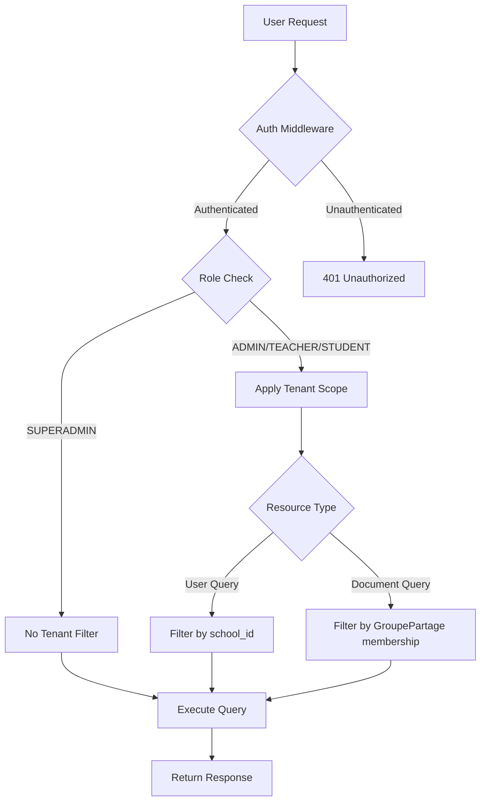
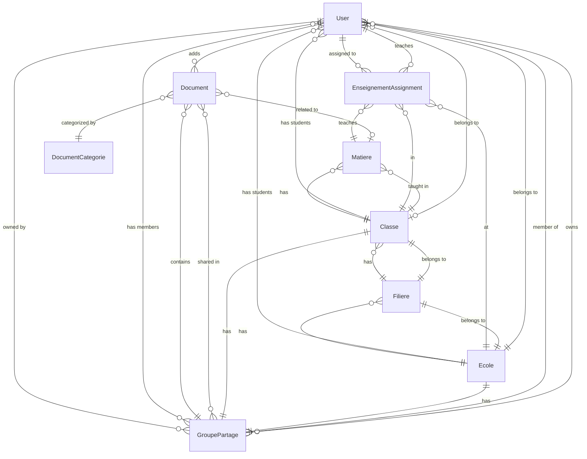

# Design Document: Node.js to Laravel Migration

## Overview

This design document outlines the architecture and implementation strategy for migrating a Node.js/Express/TypeORM backend to Laravel 12 (PHP 8.3+). The migration maintains feature parity while adopting Laravel conventions and best practices.

### Migration Philosophy

The migration follows these principles:

1. **Convention over Configuration**: Leverage Laravel's conventions (directory structure, naming, facades) rather than replicating Node.js patterns
2. **Service Layer Pattern**: Business logic resides in Service classes, controllers remain thin
3. **API Resources for Transformation**: Use Eloquent API Resources instead of manual JSON serialization
4. **FormRequests for Validation**: Centralize validation logic in FormRequest classes
5. **Eloquent ORM**: Replace TypeORM with Eloquent, using relationships and query builder
6. **Sanctum for Authentication**: Replace JWT with Laravel Sanctum for stateless API authentication
7. **Laravel Broadcasting**: Replace Socket.io with Laravel's broadcasting system (Reverb/Pusher)

### Technology Stack Comparison

| Component | Node.js (Source) | Laravel (Target) |
|-----------|------------------|------------------|
| Runtime | Node.js 18+ | PHP 8.3+ |
| Framework | Express.js | Laravel 12 |
| ORM | TypeORM | Eloquent ORM |
| Authentication | JWT (jsonwebtoken) | Laravel Sanctum |
| Validation | Manual/class-validator | FormRequests |
| File Storage | Custom uploads/ | Storage Facade |
| Real-time | Socket.io | Broadcasting/Reverb |
| Search | OpenSearch client | OpenSearch PHP client |
| Logging | Winston | Laravel Log (Monolog) |
| Testing | Jest | PHPUnit/Pest |
| Database | MySQL | MySQL |

## Architecture

### Directory Structure


```
lefax-php/
├── app/
│   ├── Http/
│   │   ├── Controllers/        # Thin controllers (route handlers)
│   │   ├── Middleware/         # Request filtering (auth, tenant, rate limit)
│   │   ├── Requests/           # FormRequest validation classes
│   │   └── Resources/          # API response transformers
│   ├── Models/                 # Eloquent models
│   ├── Services/               # Business logic layer
│   ├── Observers/              # Model event listeners
│   ├── Events/                 # Event classes for broadcasting
│   ├── Listeners/              # Event handlers
│   └── Exceptions/             # Custom exception classes
├── database/
│   ├── migrations/             # Schema definitions
│   ├── seeders/                # Initial data
│   └── factories/              # Test data generators
├── routes/
│   ├── api.php                 # API routes
│   └── channels.php            # Broadcasting channels
├── config/                     # Configuration files
├── storage/
│   └── app/
│       └── documents/          # Uploaded files
└── tests/
    ├── Feature/                # Integration tests
    └── Unit/                   # Unit tests
```

### Layered Architecture

```
┌─────────────────────────────────────────┐
│         HTTP Request (API)              │
└─────────────────┬───────────────────────┘
                  │
┌─────────────────▼───────────────────────┐
│  Middleware Layer                       │
│  - Authentication (Sanctum)             │
│  - Authorization (Policies/Gates)       │
│  - Rate Limiting                        │
│  - Tenant Scoping                       │
└─────────────────┬───────────────────────┘
                  │
┌─────────────────▼───────────────────────┐
│  Controller Layer (Thin)                │
│  - Route handling                       │
│  - Request delegation                   │
│  - Response formatting (Resources)      │
└─────────────────┬───────────────────────┘
                  │
┌─────────────────▼───────────────────────┐
│  Service Layer (Business Logic)         │
│  - UserService                          │
│  - DocumentService                      │
│  - GroupePartageService                 │
│  - SearchService                        │
│  - NotificationService                  │
└─────────────────┬───────────────────────┘
                  │
┌─────────────────▼───────────────────────┐
│  Model Layer (Eloquent ORM)             │
│  - User, Ecole, Classe, Document        │
│  - Relationships & Scopes               │
│  - Accessors & Mutators                 │
└─────────────────┬───────────────────────┘
                  │
┌─────────────────▼───────────────────────┐
│  Database (MySQL)                       │
└─────────────────────────────────────────┘
```

### Multi-Tenant Architecture

The system implements multi-tenancy at the school (Ecole) level:

1. **Tenant Identification**: Each user belongs to a school (except SUPERADMIN)
2. **Data Isolation**: Middleware applies tenant scopes to queries
3. **Sharing Groups**: GroupePartage entities control cross-tenant document sharing
4. **Automatic Enrollment**: Users automatically join school/class sharing groups



## Components and Interfaces

### 1. Database Migrations

**Purpose**: Define database schema using Laravel migrations

**Key Migrations**:


- `create_users_table`: User accounts with roles, school/class associations
- `create_ecoles_table`: Schools (tenant root entities)
- `create_classes_table`: Classes within schools
- `create_documents_table`: Document metadata
- `create_groupe_partages_table`: Sharing groups
- `create_notifications_table`: User notifications
- `create_audit_logs_table`: Security audit trail
- `create_security_events_table`: Security monitoring
- `create_daily_metrics_table`: Analytics data
- Pivot tables: `document_groupes_partage`, `groupe_partage_users`, `groupe_partage_allowed_publishers`

**Migration Pattern**:

```php
public function up(): void
{
    Schema::create('users', function (Blueprint $table) {
        $table->uuid('id')->primary();
        $table->string('first_name');
        $table->string('last_name');
        $table->string('email')->unique();
        $table->string('google_id')->unique()->nullable();
        $table->string('phone_number');
        $table->string('password')->nullable();
        $table->string('matricule', 50)->unique()->nullable();
        $table->enum('role', ['superadmin', 'admin', 'enseignant', 'etudiant', 'user'])->default('user');
        $table->boolean('is_active')->default(true);
        $table->boolean('is_suspended')->default(false);
        $table->boolean('is_delegate')->nullable();
        $table->boolean('is_verified')->default(false);
        $table->boolean('can_create_school')->default(false);
        $table->boolean('can_view_all_groups')->default(false);
        $table->string('reset_password_token')->nullable();
        $table->timestamp('reset_password_expires')->nullable();
        $table->timestamp('last_login')->nullable();
        $table->foreignUuid('school_id')->nullable()->constrained('ecoles')->onDelete('set null');
        $table->foreignUuid('class_id')->nullable()->constrained('classes')->onDelete('set null');
        $table->timestamps();
        
        $table->index(['email', 'role', 'school_id']);
    });
}
```

### 2. Eloquent Models

**Purpose**: Define data models with relationships and business logic

**User Model** (`app/Models/User.php`):

```php
<?php

namespace App\Models;

use Illuminate\Database\Eloquent\Concerns\HasUuids;
use Illuminate\Database\Eloquent\Factories\HasFactory;
use Illuminate\Foundation\Auth\User as Authenticatable;
use Illuminate\Notifications\Notifiable;
use Laravel\Sanctum\HasApiTokens;

class User extends Authenticatable
{
    use HasApiTokens, HasFactory, Notifiable, HasUuids;

    protected $fillable = [
        'first_name', 'last_name', 'email', 'google_id', 'phone_number',
        'password', 'matricule', 'role', 'is_active', 'is_suspended',
        'is_delegate', 'is_verified', 'can_create_school', 'can_view_all_groups',
        'school_id', 'class_id', 'last_login'
    ];

    protected $hidden = ['password', 'reset_password_token'];

    protected $casts = [
        'is_active' => 'boolean',
        'is_suspended' => 'boolean',
        'is_delegate' => 'boolean',
        'is_verified' => 'boolean',
        'can_create_school' => 'boolean',
        'can_view_all_groups' => 'boolean',
        'last_login' => 'datetime',
        'reset_password_expires' => 'datetime',
    ];

    // Relationships
    public function school()
    {
        return $this->belongsTo(Ecole::class, 'school_id');
    }

    public function classe()
    {
        return $this->belongsTo(Classe::class, 'class_id');
    }

    public function addedDocuments()
    {
        return $this->hasMany(Document::class, 'added_by_id');
    }

    public function groupesPartage()
    {
        return $this->belongsToMany(GroupePartage::class, 'groupe_partage_users');
    }

    public function ownedGroupesPartage()
    {
        return $this->hasMany(GroupePartage::class, 'owner_id');
    }

    public function enseignements()
    {
        return $this->hasMany(EnseignementAssignment::class, 'enseignant_id');
    }

    public function ecoles()
    {
        return $this->hasMany(Ecole::class, 'school_admin_id');
    }

    public function searchPreferences()
    {
        return $this->hasMany(UserSearchPreference::class);
    }

    // Scopes
    public function scopeActive($query)
    {
        return $query->where('is_active', true)->where('is_suspended', false);
    }

    public function scopeBySchool($query, $schoolId)
    {
        return $query->where('school_id', $schoolId);
    }

    // Accessors
    public function getFullNameAttribute(): string
    {
        return "{$this->first_name} {$this->last_name}";
    }

    // Helper methods
    public function isSuperAdmin(): bool
    {
        return $this->role === 'superadmin';
    }

    public function isAdmin(): bool
    {
        return in_array($this->role, ['admin', 'superadmin']);
    }

    public function canAccessSchool(string $schoolId): bool
    {
        return $this->isSuperAdmin() || $this->school_id === $schoolId;
    }
}
```

**Document Model** (`app/Models/Document.php`):

```php
<?php

namespace App\Models;

use Illuminate\Database\Eloquent\Concerns\HasUuids;
use Illuminate\Database\Eloquent\Factories\HasFactory;
use Illuminate\Database\Eloquent\Model;

class Document extends Model
{
    use HasFactory, HasUuids;

    protected $fillable = [
        'document_name', 'document_url', 'description', 'is_downloadable',
        'download_count', 'file_size', 'file_type', 'view_count',
        'categorie_id', 'added_by_id', 'matiere_id'
    ];

    protected $casts = [
        'is_downloadable' => 'boolean',
        'download_count' => 'integer',
        'file_size' => 'integer',
        'view_count' => 'integer',
    ];

    public function categorie()
    {
        return $this->belongsTo(DocumentCategorie::class, 'categorie_id');
    }

    public function addedBy()
    {
        return $this->belongsTo(User::class, 'added_by_id');
    }

    public function matiere()
    {
        return $this->belongsTo(Matiere::class, 'matiere_id');
    }

    public function groupesPartage()
    {
        return $this->belongsToMany(GroupePartage::class, 'document_groupes_partage');
    }

    public function incrementDownloadCount(): void
    {
        $this->increment('download_count');
    }

    public function incrementViewCount(): void
    {
        $this->increment('view_count');
    }
}
```

**GroupePartage Model** (`app/Models/GroupePartage.php`):

```php
<?php

namespace App\Models;

use Illuminate\Database\Eloquent\Concerns\HasUuids;
use Illuminate\Database\Eloquent\Factories\HasFactory;
use Illuminate\Database\Eloquent\Model;

class GroupePartage extends Model
{
    use HasFactory, HasUuids;

    protected $fillable = [
        'groupe_name', 'description', 'type', 'owner_id',
        'invitation_token', 'invitation_expires_at', 'is_active', 'is_public'
    ];

    protected $casts = [
        'is_active' => 'boolean',
        'is_public' => 'boolean',
        'invitation_expires_at' => 'datetime',
    ];

    public function owner()
    {
        return $this->belongsTo(User::class, 'owner_id');
    }

    public function users()
    {
        return $this->belongsToMany(User::class, 'groupe_partage_users');
    }

    public function allowedPublishers()
    {
        return $this->belongsToMany(User::class, 'groupe_partage_allowed_publishers');
    }

    public function documents()
    {
        return $this->belongsToMany(Document::class, 'document_groupes_partage');
    }

    public function classe()
    {
        return $this->hasOne(Classe::class, 'groupe_partage_id');
    }

    public function ecole()
    {
        return $this->hasOne(Ecole::class, 'groupe_partage_id');
    }

    public function notifications()
    {
        return $this->hasMany(Notification::class);
    }

    public function canUserPublish(User $user): bool
    {
        if ($user->isSuperAdmin()) {
            return true;
        }

        if ($this->owner_id === $user->id) {
            return true;
        }

        return $this->allowedPublishers()->where('user_id', $user->id)->exists();
    }
}
```

### 3. Authentication System

**Purpose**: Replace JWT with Laravel Sanctum for stateless API authentication

**Sanctum Configuration** (`config/sanctum.php`):

- Token expiration: 24 hours (configurable)
- Stateless mode for API-only authentication
- Token abilities for fine-grained permissions (optional)

**AuthController** (`app/Http/Controllers/AuthController.php`):


```php
<?php

namespace App\Http\Controllers;

use App\Http\Requests\LoginRequest;
use App\Http\Resources\UserResource;
use App\Services\AuthService;
use Illuminate\Http\JsonResponse;

class AuthController extends Controller
{
    public function __construct(
        private AuthService $authService
    ) {}

    public function login(LoginRequest $request): JsonResponse
    {
        $result = $this->authService->login(
            $request->validated('email'),
            $request->validated('password')
        );

        if (!$result['success']) {
            return response()->json([
                'message' => $result['message'],
                'error' => $result['error']
            ], $result['status']);
        }

        return response()->json([
            'user' => new UserResource($result['user']),
            'token' => $result['token']
        ]);
    }

    public function logout(): JsonResponse
    {
        auth()->user()->currentAccessToken()->delete();

        return response()->json(['message' => 'Logged out successfully']);
    }

    public function me(): JsonResponse
    {
        return response()->json([
            'user' => new UserResource(auth()->user()->load(['school', 'classe', 'groupesPartage']))
        ]);
    }
}
```

**AuthService** (`app/Services/AuthService.php`):

```php
<?php

namespace App\Services;

use App\Models\User;
use Illuminate\Support\Facades\Hash;

class AuthService
{
    public function login(string $email, string $password): array
    {
        $user = User::where('email', $email)
            ->with(['school', 'classe', 'groupesPartage', 'enseignements', 'ecoles'])
            ->first();

        if (!$user) {
            return [
                'success' => false,
                'message' => 'Invalid credentials',
                'error' => 'INVALID_CREDENTIALS',
                'status' => 401
            ];
        }

        if (!Hash::check($password, $user->password)) {
            return [
                'success' => false,
                'message' => 'Invalid credentials',
                'error' => 'INVALID_CREDENTIALS',
                'status' => 401
            ];
        }

        if (!$user->is_active) {
            return [
                'success' => false,
                'message' => 'Account disabled',
                'error' => 'ACCOUNT_DISABLED',
                'status' => 403
            ];
        }

        if ($user->is_suspended) {
            return [
                'success' => false,
                'message' => 'Account suspended',
                'error' => 'ACCOUNT_SUSPENDED',
                'status' => 403
            ];
        }

        $user->update(['last_login' => now()]);

        $token = $user->createToken('api-token')->plainTextToken;

        return [
            'success' => true,
            'user' => $user,
            'token' => $token
        ];
    }
}
```

**Authentication Middleware** (`app/Http/Middleware/Authenticate.php`):

Laravel's built-in `auth:sanctum` middleware handles token validation. Custom middleware extends this:

```php
<?php

namespace App\Http\Middleware;

use Closure;
use Illuminate\Http\Request;

class EnsureUserActive
{
    public function handle(Request $request, Closure $next)
    {
        $user = $request->user();

        if (!$user->is_active) {
            return response()->json([
                'message' => 'Account disabled',
                'error' => 'ACCOUNT_DISABLED'
            ], 403);
        }

        if ($user->is_suspended) {
            return response()->json([
                'message' => 'Account suspended',
                'error' => 'ACCOUNT_SUSPENDED'
            ], 403);
        }

        return $next($request);
    }
}
```

### 4. Authorization System

**Purpose**: Implement role-based and resource-based authorization

**Role Middleware** (`app/Http/Middleware/RequireRole.php`):

```php
<?php

namespace App\Http\Middleware;

use Closure;
use Illuminate\Http\Request;

class RequireRole
{
    public function handle(Request $request, Closure $next, string ...$roles)
    {
        $user = $request->user();

        if (!in_array($user->role, $roles)) {
            return response()->json([
                'message' => 'Access denied. Insufficient role.',
                'error' => 'INSUFFICIENT_ROLE',
                'required' => $roles,
                'current' => $user->role
            ], 403);
        }

        return $next($request);
    }
}
```

**Tenant Scoping Middleware** (`app/Http/Middleware/ScopeTenant.php`):

```php
<?php

namespace App\Http\Middleware;

use Closure;
use Illuminate\Http\Request;
use Illuminate\Database\Eloquent\Builder;
use App\Models\User;

class ScopeTenant
{
    public function handle(Request $request, Closure $next)
    {
        $user = $request->user();

        if (!$user->isSuperAdmin() && $user->school_id) {
            // Apply global scope for tenant filtering
            User::addGlobalScope('tenant', function (Builder $builder) use ($user) {
                $builder->where('school_id', $user->school_id);
            });
        }

        return $next($request);
    }
}
```

**Policy Example** (`app/Policies/DocumentPolicy.php`):

```php
<?php

namespace App\Policies;

use App\Models\Document;
use App\Models\User;

class DocumentPolicy
{
    public function view(User $user, Document $document): bool
    {
        if ($user->isSuperAdmin()) {
            return true;
        }

        // Check if user has access through any sharing group
        $userGroupIds = $user->groupesPartage->pluck('id')->toArray();
        
        if ($user->classe?->groupe_partage_id) {
            $userGroupIds[] = $user->classe->groupe_partage_id;
        }
        
        if ($user->school?->groupe_partage_id) {
            $userGroupIds[] = $user->school->groupe_partage_id;
        }

        $documentGroupIds = $document->groupesPartage->pluck('id')->toArray();

        return !empty(array_intersect($userGroupIds, $documentGroupIds));
    }

    public function delete(User $user, Document $document): bool
    {
        if ($user->isSuperAdmin()) {
            return true;
        }

        // Owner can delete
        if ($document->added_by_id === $user->id) {
            return true;
        }

        // Admin can delete documents in their school
        if ($user->isAdmin() && $document->addedBy->school_id === $user->school_id) {
            return true;
        }

        return false;
    }
}
```

### 5. Validation Layer

**Purpose**: Centralize request validation using FormRequests

**LoginRequest** (`app/Http/Requests/LoginRequest.php`):

```php
<?php

namespace App\Http\Requests;

use Illuminate\Foundation\Http\FormRequest;

class LoginRequest extends FormRequest
{
    public function authorize(): bool
    {
        return true;
    }

    public function rules(): array
    {
        return [
            'email' => ['required', 'email'],
            'password' => ['required', 'string', 'min:6'],
        ];
    }

    public function messages(): array
    {
        return [
            'email.required' => 'Email is required',
            'email.email' => 'Email must be valid',
            'password.required' => 'Password is required',
            'password.min' => 'Password must be at least 6 characters',
        ];
    }
}
```

**StoreUserRequest** (`app/Http/Requests/StoreUserRequest.php`):

```php
<?php

namespace App\Http\Requests;

use Illuminate\Foundation\Http\FormRequest;
use Illuminate\Validation\Rule;

class StoreUserRequest extends FormRequest
{
    public function authorize(): bool
    {
        $user = $this->user();
        
        // SUPERADMIN can create any user
        if ($user->isSuperAdmin()) {
            return true;
        }
        
        // ADMIN can create users in their school
        if ($user->isAdmin() && $this->input('school_id') === $user->school_id) {
            return true;
        }
        
        return false;
    }

    public function rules(): array
    {
        return [
            'first_name' => ['required', 'string', 'max:255'],
            'last_name' => ['required', 'string', 'max:255'],
            'email' => ['required', 'email', 'unique:users,email'],
            'phone_number' => ['required', 'string', 'max:20'],
            'password' => ['required', 'string', 'min:8'],
            'role' => ['required', Rule::in(['admin', 'enseignant', 'etudiant', 'user'])],
            'school_id' => ['nullable', 'uuid', 'exists:ecoles,id'],
            'class_id' => ['nullable', 'uuid', 'exists:classes,id'],
            'matricule' => ['nullable', 'string', 'max:50', 'unique:users,matricule'],
        ];
    }
}
```

**StoreDocumentRequest** (`app/Http/Requests/StoreDocumentRequest.php`):

```php
<?php

namespace App\Http\Requests;

use Illuminate\Foundation\Http\FormRequest;

class StoreDocumentRequest extends FormRequest
{
    public function authorize(): bool
    {
        return true; // Authorization handled in controller/service
    }

    public function rules(): array
    {
        return [
            'document_name' => ['required', 'string', 'max:255'],
            'description' => ['nullable', 'string'],
            'file' => ['required', 'file', 'mimes:pdf,doc,docx,ppt,pptx,xls,xlsx', 'max:10240'], // 10MB
            'categorie_id' => ['required', 'uuid', 'exists:document_categories,id'],
            'matiere_id' => ['nullable', 'uuid', 'exists:matieres,id'],
            'groupe_partage_ids' => ['required', 'array', 'min:1'],
            'groupe_partage_ids.*' => ['uuid', 'exists:groupe_partages,id'],
            'is_downloadable' => ['boolean'],
        ];
    }
}
```

### 6. API Resources

**Purpose**: Transform Eloquent models into consistent JSON responses

**UserResource** (`app/Http/Resources/UserResource.php`):


```php
<?php

namespace App\Http\Resources;

use Illuminate\Http\Request;
use Illuminate\Http\Resources\Json\JsonResource;

class UserResource extends JsonResource
{
    public function toArray(Request $request): array
    {
        return [
            'id' => $this->id,
            'firstName' => $this->first_name,
            'lastName' => $this->last_name,
            'fullName' => $this->full_name,
            'email' => $this->email,
            'phoneNumber' => $this->phone_number,
            'matricule' => $this->matricule,
            'role' => $this->role,
            'isActive' => $this->is_active,
            'isSuspended' => $this->is_suspended,
            'isDelegate' => $this->is_delegate,
            'isVerified' => $this->is_verified,
            'canCreateSchool' => $this->can_create_school,
            'canViewAllGroups' => $this->can_view_all_groups,
            'lastLogin' => $this->last_login?->toIso8601String(),
            'createdAt' => $this->created_at->toIso8601String(),
            'updatedAt' => $this->updated_at->toIso8601String(),
            
            // Conditional relationships
            'school' => $this->whenLoaded('school', fn() => new EcoleResource($this->school)),
            'classe' => $this->whenLoaded('classe', fn() => new ClasseResource($this->classe)),
            'groupesPartage' => $this->whenLoaded('groupesPartage', fn() => GroupePartageResource::collection($this->groupesPartage)),
        ];
    }
}
```

**DocumentResource** (`app/Http/Resources/DocumentResource.php`):

```php
<?php

namespace App\Http\Resources;

use Illuminate\Http\Request;
use Illuminate\Http\Resources\Json\JsonResource;

class DocumentResource extends JsonResource
{
    public function toArray(Request $request): array
    {
        return [
            'id' => $this->id,
            'documentName' => $this->document_name,
            'documentUrl' => $this->document_url,
            'description' => $this->description,
            'isDownloadable' => $this->is_downloadable,
            'downloadCount' => $this->download_count,
            'fileSize' => $this->file_size,
            'fileType' => $this->file_type,
            'viewCount' => $this->view_count,
            'createdAt' => $this->created_at->toIso8601String(),
            'updatedAt' => $this->updated_at->toIso8601String(),
            
            'categorie' => $this->whenLoaded('categorie', fn() => new DocumentCategorieResource($this->categorie)),
            'addedBy' => $this->whenLoaded('addedBy', fn() => new UserResource($this->addedBy)),
            'matiere' => $this->whenLoaded('matiere', fn() => new MatiereResource($this->matiere)),
            'groupesPartage' => $this->whenLoaded('groupesPartage', fn() => GroupePartageResource::collection($this->groupesPartage)),
        ];
    }
}
```

### 7. Service Layer

**Purpose**: Encapsulate business logic separate from controllers

**UserService** (`app/Services/UserService.php`):

```php
<?php

namespace App\Services;

use App\Models\User;
use App\Models\Classe;
use Illuminate\Support\Facades\Hash;
use Illuminate\Pagination\LengthAwarePaginator;

class UserService
{
    public function __construct(
        private AutoGroupEnrollmentService $enrollmentService
    ) {}

    public function createUser(array $data): User
    {
        if (isset($data['password'])) {
            $data['password'] = Hash::make($data['password']);
        }

        $user = User::create($data);

        // Auto-enroll in school/class groups
        if ($user->school_id) {
            $this->enrollmentService->enrollUserInSchoolGroup($user);
        }

        if ($user->class_id) {
            $this->enrollmentService->enrollUserInClassGroup($user);
            
            // Set role to ETUDIANT if assigned to class
            if ($user->role !== 'enseignant') {
                $user->update(['role' => 'etudiant']);
            }
        }

        return $user->fresh(['school', 'classe', 'groupesPartage']);
    }

    public function updateUser(User $user, array $data): User
    {
        if (isset($data['password'])) {
            $data['password'] = Hash::make($data['password']);
        }

        $oldClassId = $user->class_id;
        $oldSchoolId = $user->school_id;

        $user->update($data);

        // Handle class/school changes
        if (isset($data['class_id']) && $data['class_id'] !== $oldClassId) {
            if ($oldClassId) {
                $this->enrollmentService->unenrollUserFromClassGroup($user, $oldClassId);
            }
            if ($data['class_id']) {
                $this->enrollmentService->enrollUserInClassGroup($user);
            }
        }

        if (isset($data['school_id']) && $data['school_id'] !== $oldSchoolId) {
            if ($oldSchoolId) {
                $this->enrollmentService->unenrollUserFromSchoolGroup($user, $oldSchoolId);
            }
            if ($data['school_id']) {
                $this->enrollmentService->enrollUserInSchoolGroup($user);
            }
        }

        return $user->fresh(['school', 'classe', 'groupesPartage']);
    }

    public function suspendUser(User $user): User
    {
        $user->update(['is_suspended' => true]);
        
        // Revoke all tokens
        $user->tokens()->delete();

        return $user;
    }

    public function listUsers(array $filters, int $perPage = 15): LengthAwarePaginator
    {
        $query = User::query()->with(['school', 'classe']);

        if (isset($filters['school_id'])) {
            $query->where('school_id', $filters['school_id']);
        }

        if (isset($filters['role'])) {
            $query->where('role', $filters['role']);
        }

        if (isset($filters['search'])) {
            $search = $filters['search'];
            $query->where(function ($q) use ($search) {
                $q->where('first_name', 'like', "%{$search}%")
                  ->orWhere('last_name', 'like', "%{$search}%")
                  ->orWhere('email', 'like', "%{$search}%")
                  ->orWhere('matricule', 'like', "%{$search}%");
            });
        }

        return $query->paginate($perPage);
    }
}
```

**DocumentService** (`app/Services/DocumentService.php`):

```php
<?php

namespace App\Services;

use App\Models\Document;
use App\Models\User;
use Illuminate\Http\UploadedFile;
use Illuminate\Support\Facades\Storage;
use Illuminate\Pagination\LengthAwarePaginator;

class DocumentService
{
    public function __construct(
        private OpenSearchService $searchService,
        private AuditLogService $auditService
    ) {}

    public function createDocument(array $data, UploadedFile $file, User $user): Document
    {
        // Store file
        $schoolId = $user->school_id ?? 'global';
        $path = $file->store("schools/{$schoolId}/documents", 'public');

        // Create document record
        $document = Document::create([
            'document_name' => $data['document_name'],
            'document_url' => $path,
            'description' => $data['description'] ?? null,
            'file_size' => $file->getSize(),
            'file_type' => $file->getClientOriginalExtension(),
            'is_downloadable' => $data['is_downloadable'] ?? true,
            'categorie_id' => $data['categorie_id'],
            'matiere_id' => $data['matiere_id'] ?? null,
            'added_by_id' => $user->id,
        ]);

        // Attach to sharing groups
        $document->groupesPartage()->attach($data['groupe_partage_ids']);

        // Index in OpenSearch
        $this->searchService->indexDocument($document);

        // Audit log
        $this->auditService->log('document.created', $user, $document);

        return $document->fresh(['categorie', 'addedBy', 'matiere', 'groupesPartage']);
    }

    public function getUserAccessibleDocuments(User $user, array $filters, int $perPage = 15): LengthAwarePaginator
    {
        $query = Document::query()->with(['categorie', 'addedBy', 'matiere', 'groupesPartage']);

        if (!$user->isSuperAdmin()) {
            // Get user's accessible group IDs
            $groupIds = $user->groupesPartage->pluck('id')->toArray();
            
            if ($user->classe?->groupe_partage_id) {
                $groupIds[] = $user->classe->groupe_partage_id;
            }
            
            if ($user->school?->groupe_partage_id) {
                $groupIds[] = $user->school->groupe_partage_id;
            }

            $query->whereHas('groupesPartage', function ($q) use ($groupIds) {
                $q->whereIn('groupe_partages.id', $groupIds);
            });
        }

        if (isset($filters['categorie_id'])) {
            $query->where('categorie_id', $filters['categorie_id']);
        }

        if (isset($filters['matiere_id'])) {
            $query->where('matiere_id', $filters['matiere_id']);
        }

        return $query->latest()->paginate($perPage);
    }

    public function downloadDocument(Document $document, User $user): string
    {
        $document->incrementDownloadCount();
        
        $this->auditService->log('document.downloaded', $user, $document);

        return Storage::disk('public')->path($document->document_url);
    }

    public function deleteDocument(Document $document, User $user): void
    {
        // Remove from storage
        Storage::disk('public')->delete($document->document_url);

        // Remove from OpenSearch
        $this->searchService->deleteDocument($document->id);

        // Audit log
        $this->auditService->log('document.deleted', $user, $document);

        // Delete record
        $document->delete();
    }
}
```

**GroupePartageService** (`app/Services/GroupePartageService.php`):

```php
<?php

namespace App\Services;

use App\Models\GroupePartage;
use App\Models\User;
use Illuminate\Support\Str;

class GroupePartageService
{
    public function createCustomGroup(array $data, User $owner): GroupePartage
    {
        $group = GroupePartage::create([
            'groupe_name' => $data['groupe_name'],
            'description' => $data['description'] ?? null,
            'type' => 'custom',
            'owner_id' => $owner->id,
            'is_public' => $data['is_public'] ?? false,
        ]);

        // Add owner as member
        $group->users()->attach($owner->id);

        // Add initial members if provided
        if (isset($data['user_ids'])) {
            $group->users()->attach($data['user_ids']);
        }

        return $group->fresh(['owner', 'users']);
    }

    public function generateInvitationToken(GroupePartage $group): string
    {
        $token = Str::random(32);
        
        $group->update([
            'invitation_token' => $token,
            'invitation_expires_at' => now()->addDays(7),
        ]);

        return $token;
    }

    public function joinViaToken(string $token, User $user): GroupePartage
    {
        $group = GroupePartage::where('invitation_token', $token)
            ->where('invitation_expires_at', '>', now())
            ->firstOrFail();

        if (!$group->users()->where('user_id', $user->id)->exists()) {
            $group->users()->attach($user->id);
        }

        return $group->fresh(['users']);
    }

    public function addAllowedPublisher(GroupePartage $group, string $userId): void
    {
        if (!$group->allowedPublishers()->where('user_id', $userId)->exists()) {
            $group->allowedPublishers()->attach($userId);
        }
    }
}
```

### 8. File Storage

**Purpose**: Manage file uploads using Laravel Storage facade

**Storage Configuration** (`config/filesystems.php`):

```php
'disks' => [
    'public' => [
        'driver' => 'local',
        'root' => storage_path('app/public'),
        'url' => env('APP_URL').'/storage',
        'visibility' => 'public',
    ],
    
    // For production, use S3
    's3' => [
        'driver' => 's3',
        'key' => env('AWS_ACCESS_KEY_ID'),
        'secret' => env('AWS_SECRET_ACCESS_KEY'),
        'region' => env('AWS_DEFAULT_REGION'),
        'bucket' => env('AWS_BUCKET'),
    ],
],
```

**File Organization**:
- `storage/app/public/schools/{schoolId}/documents/{filename}`
- Symbolic link: `public/storage` → `storage/app/public`

### 9. Search Integration

**Purpose**: Integrate OpenSearch for document content search

**OpenSearchService** (`app/Services/OpenSearchService.php`):


```php
<?php

namespace App\Services;

use App\Models\Document;
use OpenSearch\Client;
use OpenSearch\ClientBuilder;

class OpenSearchService
{
    private Client $client;
    private string $indexName = 'documents';

    public function __construct()
    {
        $this->client = ClientBuilder::create()
            ->setHosts([config('services.opensearch.host')])
            ->build();
    }

    public function indexDocument(Document $document): void
    {
        $document->load(['categorie', 'addedBy', 'matiere', 'groupesPartage']);

        $params = [
            'index' => $this->indexName,
            'id' => $document->id,
            'body' => [
                'document_name' => $document->document_name,
                'description' => $document->description,
                'file_type' => $document->file_type,
                'categorie_name' => $document->categorie?->name,
                'matiere_name' => $document->matiere?->name,
                'added_by_name' => $document->addedBy->full_name,
                'groupe_partage_ids' => $document->groupesPartage->pluck('id')->toArray(),
                'created_at' => $document->created_at->toIso8601String(),
            ]
        ];

        $this->client->index($params);
    }

    public function searchDocuments(string $query, array $groupePartageIds, int $from = 0, int $size = 20): array
    {
        $params = [
            'index' => $this->indexName,
            'body' => [
                'from' => $from,
                'size' => $size,
                'query' => [
                    'bool' => [
                        'must' => [
                            'multi_match' => [
                                'query' => $query,
                                'fields' => ['document_name^3', 'description^2', 'categorie_name', 'matiere_name'],
                                'fuzziness' => 'AUTO'
                            ]
                        ],
                        'filter' => [
                            'terms' => [
                                'groupe_partage_ids' => $groupePartageIds
                            ]
                        ]
                    ]
                ],
                'highlight' => [
                    'fields' => [
                        'document_name' => new \stdClass(),
                        'description' => new \stdClass()
                    ]
                ]
            ]
        ];

        $response = $this->client->search($params);

        return [
            'total' => $response['hits']['total']['value'],
            'hits' => array_map(function ($hit) {
                return [
                    'id' => $hit['_id'],
                    'score' => $hit['_score'],
                    'source' => $hit['_source'],
                    'highlight' => $hit['highlight'] ?? []
                ];
            }, $response['hits']['hits'])
        ];
    }

    public function deleteDocument(string $documentId): void
    {
        $params = [
            'index' => $this->indexName,
            'id' => $documentId
        ];

        $this->client->delete($params);
    }

    public function updateDocument(Document $document): void
    {
        $this->indexDocument($document);
    }
}
```

### 10. Real-Time Notifications

**Purpose**: Replace Socket.io with Laravel Broadcasting

**Broadcasting Configuration** (`config/broadcasting.php`):

```php
'connections' => [
    'reverb' => [
        'driver' => 'reverb',
        'key' => env('REVERB_APP_KEY'),
        'secret' => env('REVERB_APP_SECRET'),
        'app_id' => env('REVERB_APP_ID'),
        'options' => [
            'host' => env('REVERB_HOST', '0.0.0.0'),
            'port' => env('REVERB_PORT', 8080),
            'scheme' => env('REVERB_SCHEME', 'http'),
        ],
    ],
],
```

**NotificationEvent** (`app/Events/NotificationCreated.php`):

```php
<?php

namespace App\Events;

use App\Models\Notification;
use Illuminate\Broadcasting\Channel;
use Illuminate\Broadcasting\InteractsWithSockets;
use Illuminate\Contracts\Broadcasting\ShouldBroadcast;
use Illuminate\Foundation\Events\Dispatchable;
use Illuminate\Queue\SerializesModels;

class NotificationCreated implements ShouldBroadcast
{
    use Dispatchable, InteractsWithSockets, SerializesModels;

    public function __construct(
        public Notification $notification
    ) {}

    public function broadcastOn(): Channel
    {
        return new Channel('user.' . $this->notification->user_id);
    }

    public function broadcastAs(): string
    {
        return 'notification.created';
    }

    public function broadcastWith(): array
    {
        return [
            'id' => $this->notification->id,
            'type' => $this->notification->type,
            'title' => $this->notification->title,
            'message' => $this->notification->message,
            'data' => $this->notification->data,
            'createdAt' => $this->notification->created_at->toIso8601String(),
        ];
    }
}
```

**NotificationService** (`app/Services/NotificationService.php`):

```php
<?php

namespace App\Services;

use App\Models\Notification;
use App\Models\GroupePartage;
use App\Models\Document;
use App\Events\NotificationCreated;

class NotificationService
{
    public function notifyDocumentShared(Document $document, GroupePartage $group): void
    {
        $users = $group->users;

        foreach ($users as $user) {
            // Don't notify the uploader
            if ($user->id === $document->added_by_id) {
                continue;
            }

            $notification = Notification::create([
                'user_id' => $user->id,
                'type' => 'document_shared',
                'title' => 'New Document Shared',
                'message' => "{$document->addedBy->full_name} shared a document: {$document->document_name}",
                'data' => [
                    'document_id' => $document->id,
                    'groupe_partage_id' => $group->id,
                ],
                'groupe_partage_id' => $group->id,
            ]);

            broadcast(new NotificationCreated($notification))->toOthers();
        }
    }

    public function markAsRead(Notification $notification): void
    {
        $notification->update(['is_read' => true, 'read_at' => now()]);
    }
}
```

**Broadcasting Channel Authentication** (`routes/channels.php`):

```php
<?php

use Illuminate\Support\Facades\Broadcast;

Broadcast::channel('user.{userId}', function ($user, $userId) {
    return (int) $user->id === (int) $userId;
});
```

### 11. Audit Logging

**Purpose**: Track user actions for security and compliance

**AuditLogService** (`app/Services/AuditLogService.php`):

```php
<?php

namespace App\Services;

use App\Models\AuditLog;
use App\Models\User;
use Illuminate\Database\Eloquent\Model;

class AuditLogService
{
    public function log(string $action, User $user, ?Model $resource = null, ?array $metadata = null): AuditLog
    {
        return AuditLog::create([
            'user_id' => $user->id,
            'action' => $action,
            'resource_type' => $resource ? get_class($resource) : null,
            'resource_id' => $resource?->id,
            'ip_address' => request()->ip(),
            'user_agent' => request()->userAgent(),
            'metadata' => $metadata,
        ]);
    }
}
```

**AuditLog Model** (`app/Models/AuditLog.php`):

```php
<?php

namespace App\Models;

use Illuminate\Database\Eloquent\Concerns\HasUuids;
use Illuminate\Database\Eloquent\Factories\HasFactory;
use Illuminate\Database\Eloquent\Model;

class AuditLog extends Model
{
    use HasFactory, HasUuids;

    protected $fillable = [
        'user_id', 'action', 'resource_type', 'resource_id',
        'ip_address', 'user_agent', 'metadata'
    ];

    protected $casts = [
        'metadata' => 'array',
    ];

    public function user()
    {
        return $this->belongsTo(User::class);
    }
}
```

### 12. Rate Limiting

**Purpose**: Protect API from abuse

**Rate Limit Configuration** (`app/Providers/RouteServiceProvider.php`):

```php
protected function configureRateLimiting()
{
    RateLimiter::for('api', function (Request $request) {
        return $request->user()
            ? Limit::perMinute(60)->by($request->user()->id)
            : Limit::perMinute(10)->by($request->ip());
    });

    RateLimiter::for('auth', function (Request $request) {
        return Limit::perMinute(5)->by($request->ip());
    });
}
```

**Route Application** (`routes/api.php`):

```php
Route::middleware(['throttle:auth'])->group(function () {
    Route::post('/login', [AuthController::class, 'login']);
});

Route::middleware(['auth:sanctum', 'throttle:api'])->group(function () {
    // Protected routes
});
```

## Data Models

### Entity Relationship Diagram



### Key Model Relationships

**User**:
- belongsTo: Ecole (school), Classe (classe)
- hasMany: Document (addedDocuments), EnseignementAssignment (enseignements), Ecole (ecoles as admin)
- belongsToMany: GroupePartage (groupesPartage, ownedGroupesPartage)

**Ecole**:
- belongsTo: User (schoolAdmin)
- hasMany: User (students), Filiere (filieres), EnseignementAssignment
- hasOne: GroupePartage

**Document**:
- belongsTo: User (addedBy), DocumentCategorie (categorie), Matiere (matiere)
- belongsToMany: GroupePartage (groupesPartage)

**GroupePartage**:
- belongsTo: User (owner)
- belongsToMany: User (users, allowedPublishers), Document (documents)
- hasOne: Classe, Ecole, Filiere, Matiere


## Correctness Properties

*A property is a characteristic or behavior that should hold true across all valid executions of a system—essentially, a formal statement about what the system should do. Properties serve as the bridge between human-readable specifications and machine-verifiable correctness guarantees.*

### Database Schema Properties

**Property 1: Foreign Key Cascade Behavior**
*For any* parent record with foreign key relationships, when the parent is deleted or updated, the system should enforce the defined cascade behavior (CASCADE, SET NULL, RESTRICT) consistently across all child records.
**Validates: Requirements 1.2**

**Property 2: Unique Constraint Enforcement**
*For any* attempt to insert or update a record with a value that violates a unique constraint (email, googleId, matricule), the database should reject the operation with a constraint violation error.
**Validates: Requirements 1.6**

**Property 3: Enum Value Validation**
*For any* attempt to set an enum column (role, type) to an invalid value, the system should reject the operation and return a validation error.
**Validates: Requirements 1.7**

### Model Relationship Properties

**Property 4: Relationship Loading Consistency**
*For any* Eloquent model with defined relationships, loading a relationship should return the correct related models based on foreign key associations.
**Validates: Requirements 2.1**

**Property 5: Sensitive Data Hiding**
*For any* model instance serialized to JSON, sensitive fields marked as hidden (password, reset_password_token) should not appear in the output.
**Validates: Requirements 2.3**

**Property 6: Attribute Type Casting**
*For any* model attribute with a defined cast, retrieving the attribute should return a value of the correct PHP type (boolean for is_active, datetime for timestamps, array for JSON columns).
**Validates: Requirements 2.4**

**Property 7: Model Event Execution**
*For any* User model created with a class_id and role not equal to 'enseignant', the model should automatically have its role set to 'etudiant' before insertion.
**Validates: Requirements 2.9**

### Authentication Properties

**Property 8: Valid Credential Authentication**
*For any* user with valid credentials (correct email and password), a login attempt should generate a Sanctum token and return it in the response.
**Validates: Requirements 3.1**

**Property 9: Invalid Token Rejection**
*For any* API request with an invalid, malformed, or missing authentication token, the system should return a 401 Unauthorized response with an appropriate error code.
**Validates: Requirements 3.2**

**Property 10: Suspended Account Rejection**
*For any* user account with is_suspended set to true, authentication attempts should be rejected with a 403 Forbidden response and error code ACCOUNT_SUSPENDED.
**Validates: Requirements 3.3**

**Property 11: Inactive Account Rejection**
*For any* user account with is_active set to false, authentication attempts should be rejected with a 403 Forbidden response and error code ACCOUNT_DISABLED.
**Validates: Requirements 3.4**

**Property 12: Authenticated Request Relationship Loading**
*For any* authenticated API request, the user object should have school, classe, groupesPartage, enseignements, and ecoles relationships loaded for authorization checks.
**Validates: Requirements 3.6**

**Property 13: Role Change Reflection**
*For any* user whose role is changed in the database, subsequent authenticated requests should reflect the new role without requiring re-authentication.
**Validates: Requirements 3.7**

### Authorization Properties

**Property 14: SUPERADMIN Unrestricted Access**
*For any* user with role 'superadmin', queries for users, documents, or other tenant-scoped resources should return all records without tenant filtering.
**Validates: Requirements 4.1, 5.7**

**Property 15: ADMIN School Scoping**
*For any* user with role 'admin' and a school_id, queries for users should only return users belonging to the same school.
**Validates: Requirements 4.2, 5.1**


**Property 16: ENSEIGNANT Class Access Restriction**
*For any* user with role 'enseignant', access to class-scoped resources should be limited to classes they teach (via enseignements relationship).
**Validates: Requirements 4.3**

**Property 17: ETUDIANT Document Access Restriction**
*For any* user with role 'etudiant', document queries should only return documents shared in GroupePartage instances where the user is a member.
**Validates: Requirements 4.4, 5.2**

**Property 18: Insufficient Role Rejection**
*For any* API endpoint with role requirements, requests from users lacking the required role should return 403 Forbidden with error code INSUFFICIENT_ROLE and include both required and current roles.
**Validates: Requirements 4.5**

**Property 19: Resource Access Group Membership Verification**
*For any* document or resource access attempt, the system should verify the user is a member of at least one GroupePartage associated with the resource before granting access.
**Validates: Requirements 4.6**

**Property 20: View All Groups Permission**
*For any* user with can_view_all_groups set to true, GroupePartage queries should return all groups within their tenant, not just groups they are members of.
**Validates: Requirements 4.7**

### Multi-Tenant Properties

**Property 21: Automatic School GroupePartage Creation**
*For any* newly created Ecole, the system should automatically create a linked GroupePartage with type 'school'.
**Validates: Requirements 5.3**

**Property 22: Automatic Class GroupePartage Creation**
*For any* newly created Classe, the system should automatically create a linked GroupePartage with type 'class'.
**Validates: Requirements 5.4**

**Property 23: School Assignment Auto-Enrollment**
*For any* user assigned to a school (school_id set), the system should automatically add the user to the school's GroupePartage.
**Validates: Requirements 5.5**

**Property 24: Class Assignment Auto-Enrollment and Role Setting**
*For any* user assigned to a class (class_id set) with role not equal to 'enseignant', the system should automatically add the user to the class's GroupePartage and set their role to 'etudiant'.
**Validates: Requirements 5.6**

### User Management Properties

**Property 25: Valid User Creation**
*For any* valid user creation request (passing FormRequest validation), the system should create the user record and return a 201 Created response with a UserResource.
**Validates: Requirements 6.1**

**Property 26: Duplicate Email Rejection**
*For any* user creation attempt with an email that already exists in the database, the system should return 422 Unprocessable Entity with a validation error.
**Validates: Requirements 6.2**

**Property 27: User Update Permission Validation**
*For any* user update request, the system should verify the authenticated user has permission (ADMIN for same school, SUPERADMIN for any user) before allowing the update.
**Validates: Requirements 6.3**

**Property 28: User Suspension Token Revocation**
*For any* user suspension action, the system should set is_suspended to true and revoke all active Sanctum tokens for that user.
**Validates: Requirements 6.4**

**Property 29: User Search Multi-Field Filtering**
*For any* user search query, the system should filter results by matching the search term against first_name, last_name, email, or matricule fields.
**Validates: Requirements 6.8**

### Document Management Properties

**Property 30: Document Upload Validation and Storage**
*For any* document upload request, the system should validate file type against the whitelist (pdf, doc, docx, ppt, pptx, xls, xlsx), validate file size, and store the file using Laravel Storage facade.
**Validates: Requirements 7.1**

**Property 31: Document Metadata Extraction**
*For any* document creation, the system should extract and store file metadata (fileSize, fileType, documentName) and associate the document with the authenticated user as addedBy.
**Validates: Requirements 7.2**

**Property 32: Document Sharing Permission Validation**
*For any* document sharing attempt, the system should verify the user has permission to publish to the target GroupePartage (is owner, is in allowedPublishers, or is admin) before allowing the share.
**Validates: Requirements 7.3**

**Property 33: Document Download Tracking**
*For any* document download action, the system should increment the document's download_count and create an AuditLog entry.
**Validates: Requirements 7.5**

**Property 34: Document View Tracking**
*For any* document view action, the system should increment the document's view_count.
**Validates: Requirements 7.6**

**Property 35: Document Deletion Cleanup**
*For any* document deletion, the system should remove the file from storage, remove the document from OpenSearch index, and delete the database record.
**Validates: Requirements 7.7**

**Property 36: Document Listing N+1 Prevention**
*For any* document listing request, the system should eager load relationships (categorie, addedBy, matiere, groupesPartage) to prevent N+1 query problems.
**Validates: Requirements 7.8, 18.1**

### Sharing Group Properties

**Property 37: Custom Group Owner Assignment**
*For any* CUSTOM GroupePartage creation, the system should set the authenticated user as the owner.
**Validates: Requirements 8.1**

**Property 38: School/Class Group Creation Authorization**
*For any* attempt to create a SCHOOL or CLASS type GroupePartage, the system should only allow users with role 'admin' or 'superadmin'.
**Validates: Requirements 8.2**

**Property 39: Group Member Addition Authorization**
*For any* attempt to add users to a GroupePartage, the system should verify the authenticated user is the owner or has admin permissions.
**Validates: Requirements 8.3**

**Property 40: Invitation Token Generation**
*For any* invitation token generation request, the system should create a unique token and set an expiration timestamp 7 days in the future.
**Validates: Requirements 8.5**

**Property 41: Invitation Token Validation**
*For any* attempt to join a GroupePartage via invitation token, the system should verify the token exists, is not expired, and then add the user to the group.
**Validates: Requirements 8.6**

**Property 42: Group Listing Access Filtering**
*For any* GroupePartage listing request, the system should filter results to only include groups where the user is a member or owner (unless user is SUPERADMIN).
**Validates: Requirements 8.7**

### File Storage Properties

**Property 43: Storage Disk Abstraction**
*For any* file upload, the system should use Laravel Storage facade with the configured disk (local, s3, etc.) rather than direct filesystem operations.
**Validates: Requirements 9.1**

**Property 44: Tenant-Based File Organization**
*For any* file upload, the system should organize files by tenant using the pattern schools/{schoolId}/documents/{filename}.
**Validates: Requirements 9.2**

**Property 45: File Access Permission Validation**
*For any* file download request, the system should validate the user has access to the associated document before generating a download URL.
**Validates: Requirements 9.3**

**Property 46: File Deletion on Document Deletion**
*For any* document deletion, the system should remove the associated file from the storage disk.
**Validates: Requirements 9.4**

### Search Properties

**Property 47: Document Indexing on Creation**
*For any* document creation, the system should send the document content and metadata to OpenSearch for indexing.
**Validates: Requirements 10.1**

**Property 48: Search Result Access Filtering**
*For any* document search query, the system should filter OpenSearch results to only include documents in GroupePartage instances accessible to the authenticated user.
**Validates: Requirements 10.2**

**Property 49: Document Re-indexing on Update**
*For any* document update, the system should re-index the document in OpenSearch to reflect the changes.
**Validates: Requirements 10.3**

**Property 50: Document De-indexing on Deletion**
*For any* document deletion, the system should remove the document from the OpenSearch index.
**Validates: Requirements 10.4**


**Property 51: Search Result Highlighting**
*For any* search query that returns results, the response should include highlighting of matched terms in the document_name and description fields.
**Validates: Requirements 10.5**

**Property 52: Search Fallback on OpenSearch Unavailability**
*For any* search query when OpenSearch is unavailable, the system should fallback to database LIKE queries without throwing an error.
**Validates: Requirements 10.6**

**Property 53: Search Preference Persistence**
*For any* search preference save action, the system should create or update a UserSearchPreference record for the authenticated user.
**Validates: Requirements 10.7**

### Real-Time Notification Properties

**Property 54: Document Share Notification Creation**
*For any* document shared to a GroupePartage, the system should create Notification records for all group members except the uploader.
**Validates: Requirements 11.1**

**Property 55: Notification Broadcasting**
*For any* notification creation, the system should broadcast the notification using Laravel Broadcasting to the user-specific channel (user.{userId}).
**Validates: Requirements 11.2, 11.4**

**Property 56: Notification Channel Authentication**
*For any* attempt to connect to a user-specific notification channel, the system should authenticate the connection using the Sanctum token and verify the user ID matches.
**Validates: Requirements 11.3**

**Property 57: Notification Read Status Update**
*For any* mark-as-read action on a notification, the system should update the is_read field to true and set read_at to the current timestamp.
**Validates: Requirements 11.5**

**Property 58: Notification Listing Pagination and Filtering**
*For any* notification listing request, the system should paginate results and support filtering by read/unread status.
**Validates: Requirements 11.6**

### Validation Properties

**Property 59: FormRequest Validation Execution**
*For any* API request with a corresponding FormRequest class, the system should execute validation rules before the request reaches the controller.
**Validates: Requirements 12.1**

**Property 60: Validation Failure Response Format**
*For any* request that fails validation, the system should return a 422 Unprocessable Entity response with field-specific error messages.
**Validates: Requirements 12.2, 13.4**

**Property 61: User Creation Validation Rules**
*For any* user creation request, the system should enforce validation rules for email format, password strength, and required fields.
**Validates: Requirements 12.3**

**Property 62: Document Upload File Validation**
*For any* document upload request, the system should enforce file type whitelist and maximum file size constraints.
**Validates: Requirements 12.4**

**Property 63: FormRequest Authorization Failure**
*For any* FormRequest where the authorize() method returns false, the system should return a 403 Forbidden response.
**Validates: Requirements 12.6**

### API Response Properties

**Property 64: Single Resource Response Formatting**
*For any* API endpoint returning a single resource, the response should use an API Resource class to format the JSON output consistently.
**Validates: Requirements 13.1**

**Property 65: Collection Response Pagination Metadata**
*For any* API endpoint returning a collection, the response should use a ResourceCollection with pagination metadata (total, per_page, current_page, last_page).
**Validates: Requirements 13.2**

**Property 66: Error Response Format**
*For any* error response, the system should include a message field, an error code, and relevant context information.
**Validates: Requirements 13.3**

**Property 67: Conditional Relationship Loading**
*For any* API resource with relationships, the system should only include relationship data in the response when the relationship is loaded (using whenLoaded).
**Validates: Requirements 13.5**

**Property 68: ISO 8601 Timestamp Formatting**
*For any* timestamp field in an API response, the system should format it using ISO 8601 format (toIso8601String()).
**Validates: Requirements 13.6**

### Security and Audit Properties

**Property 69: Sensitive Action Audit Logging**
*For any* sensitive action (login, document upload, user modification), the system should create an AuditLog record with user ID, IP address, user agent, action type, and affected resource.
**Validates: Requirements 14.1, 14.3**

**Property 70: Security Event Recording**
*For any* security event (failed login, suspended account access attempt), the system should create a SecurityEvent record.
**Validates: Requirements 14.2**

**Property 71: Audit Log Access Restriction**
*For any* audit log query request, the system should restrict access to users with role 'admin' or 'superadmin'.
**Validates: Requirements 14.4**

### Rate Limiting Properties

**Property 72: Rate Limit Enforcement**
*For any* user exceeding the configured rate limit, the system should return a 429 Too Many Requests response with a retry-after header.
**Validates: Requirements 15.1**

**Property 73: Differential Rate Limiting**
*For any* API request, the system should apply different rate limits based on authentication status (60/min for authenticated, 10/min for unauthenticated).
**Validates: Requirements 15.2**

**Property 74: SUPERADMIN Rate Limit Exemption**
*For any* user with role 'superadmin', the system should apply higher rate limits or no rate limits compared to regular users.
**Validates: Requirements 15.4**

### Seeding Properties

**Property 75: Seeder Idempotency**
*For any* database seeder execution, running the seeder multiple times should not create duplicate records or throw errors.
**Validates: Requirements 16.4**

### Error Handling Properties

**Property 76: Exception Logging**
*For any* exception that occurs during request processing, the system should log error details using Laravel Log facade.
**Validates: Requirements 17.1**

**Property 77: Database Error Response Security**
*For any* database error, the system should return a 500 Internal Server Error response without exposing SQL query details or database structure.
**Validates: Requirements 17.2**

**Property 78: Validation Error Response Format**
*For any* validation error, the system should return a 422 Unprocessable Entity response with field-specific error messages.
**Validates: Requirements 17.3**

**Property 79: Not Found Error Response**
*For any* request for a non-existent resource, the system should return a 404 Not Found response with the resource type.
**Validates: Requirements 17.4**

**Property 80: Production Stack Trace Suppression**
*For any* error in production environment, the API response should not include stack traces or detailed error information.
**Validates: Requirements 17.5**

**Property 81: Development Error Detail Inclusion**
*For any* error in development environment, the API response should include detailed error information and stack traces for debugging.
**Validates: Requirements 17.6**

### Performance Properties

**Property 82: Collection Pagination**
*For any* API endpoint returning large collections, the system should paginate results with a configurable page size.
**Validates: Requirements 18.2**

**Property 83: Frequently Accessed Data Caching**
*For any* frequently accessed data (user permissions, school settings) when caching is enabled, the system should cache the data to reduce database queries.
**Validates: Requirements 18.3**

### Data Migration Properties

**Property 84: Migration Error Resilience**
*For any* data migration process, when an error occurs processing a record, the system should log the error and continue processing remaining records rather than stopping.
**Validates: Requirements 20.4**

## Error Handling

### Exception Hierarchy

The system uses Laravel's exception handling with custom exceptions:

- `AppException`: Base exception for application-specific errors
- `AuthenticationException`: Authentication failures (401)
- `AuthorizationException`: Permission denied (403)
- `ValidationException`: Input validation failures (422)
- `ModelNotFoundException`: Resource not found (404)
- `TenantAccessException`: Tenant boundary violations (403)

### Error Response Format

All error responses follow this structure:

```json
{
  "message": "Human-readable error message",
  "error": "ERROR_CODE",
  "context": {
    "field": "additional context"
  }
}
```

### Error Codes

- `NO_TOKEN`: Missing authentication token
- `INVALID_TOKEN`: Malformed or invalid token
- `TOKEN_EXPIRED`: Expired authentication token
- `ACCOUNT_DISABLED`: User account is inactive
- `ACCOUNT_SUSPENDED`: User account is suspended
- `INSUFFICIENT_ROLE`: User lacks required role
- `ACCESS_DENIED`: Resource access denied
- `VALIDATION_ERROR`: Input validation failed
- `NOT_FOUND`: Resource not found
- `TENANT_VIOLATION`: Attempted cross-tenant access

## Testing Strategy

### Dual Testing Approach

The migration requires both unit tests and property-based tests for comprehensive coverage:

**Unit Tests** (PHPUnit/Pest):
- Specific examples demonstrating correct behavior
- Edge cases (empty inputs, boundary conditions)
- Error conditions (invalid data, permission failures)
- Integration points between components
- Database migrations and seeders

**Property-Based Tests** (Not standard in PHP, use parameterized tests):
- Universal properties across all inputs
- Comprehensive input coverage through data providers
- Minimum 100 test cases per property via data providers
- Each test references its design document property

### Test Configuration

**Database**: Use in-memory SQLite for fast test execution

```php
// phpunit.xml
<env name="DB_CONNECTION" value="sqlite"/>
<env name="DB_DATABASE" value=":memory:"/>
```

**Authentication**: Use Sanctum::actingAs() for authenticated requests

```php
$user = User::factory()->create(['role' => 'admin']);
Sanctum::actingAs($user);
$response = $this->getJson('/api/users');
```

**File Storage**: Use Storage::fake() to avoid filesystem operations

```php
Storage::fake('public');
$response = $this->postJson('/api/documents', [
    'file' => UploadedFile::fake()->create('document.pdf', 1024)
]);
Storage::disk('public')->assertExists('schools/...');
```

### Critical Test Coverage

1. **Authentication Flow**: Login, token validation, account status checks
2. **Multi-Tenant Isolation**: Verify users cannot access other tenants' data
3. **Document Access Control**: Verify GroupePartage membership enforcement
4. **File Upload and Storage**: Validate file handling and storage
5. **Automatic Enrollments**: Verify school/class group auto-enrollment
6. **Role-Based Authorization**: Verify role restrictions work correctly
7. **Audit Logging**: Verify sensitive actions are logged
8. **Search Functionality**: Verify OpenSearch integration and fallback
9. **Real-Time Notifications**: Verify broadcasting works correctly
10. **Data Migration**: Verify migration commands preserve data integrity

### Example Feature Test

```php
<?php

namespace Tests\Feature;

use Tests\TestCase;
use App\Models\User;
use App\Models\Document;
use App\Models\GroupePartage;
use Laravel\Sanctum\Sanctum;
use Illuminate\Foundation\Testing\RefreshDatabase;

class DocumentAccessTest extends TestCase
{
    use RefreshDatabase;

    /** @test */
    public function student_can_only_access_documents_in_their_groups()
    {
        // Feature: nodejs-to-laravel-migration, Property 17: ETUDIANT Document Access Restriction
        
        $student = User::factory()->create(['role' => 'etudiant']);
        $group1 = GroupePartage::factory()->create();
        $group2 = GroupePartage::factory()->create();
        
        $student->groupesPartage()->attach($group1->id);
        
        $doc1 = Document::factory()->create();
        $doc2 = Document::factory()->create();
        
        $doc1->groupesPartage()->attach($group1->id);
        $doc2->groupesPartage()->attach($group2->id);
        
        Sanctum::actingAs($student);
        
        $response = $this->getJson('/api/documents');
        
        $response->assertOk();
        $response->assertJsonCount(1, 'data');
        $response->assertJsonPath('data.0.id', $doc1->id);
    }
}
```

