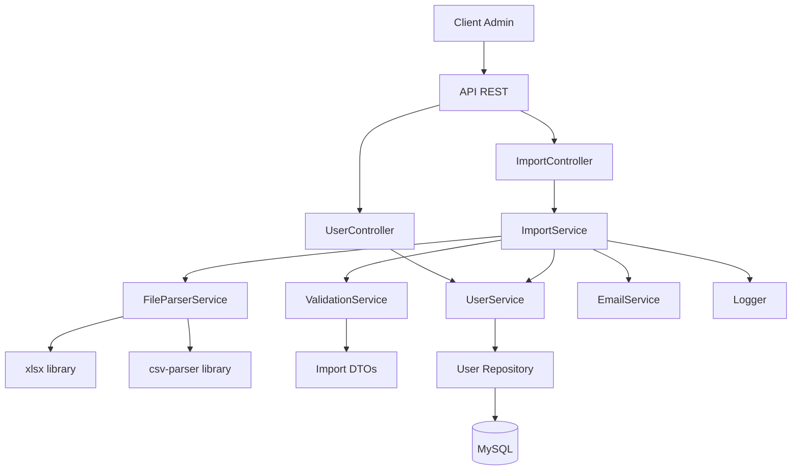
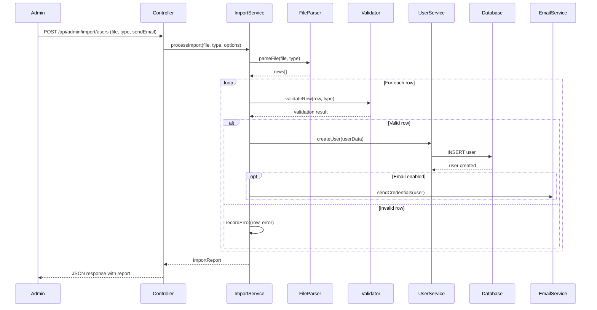
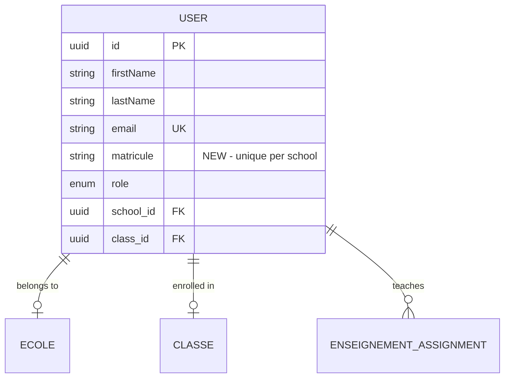
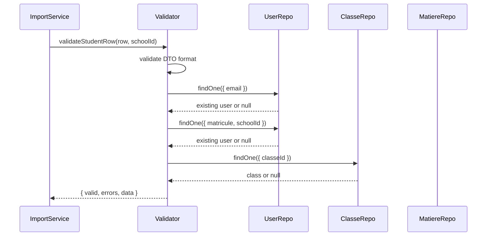
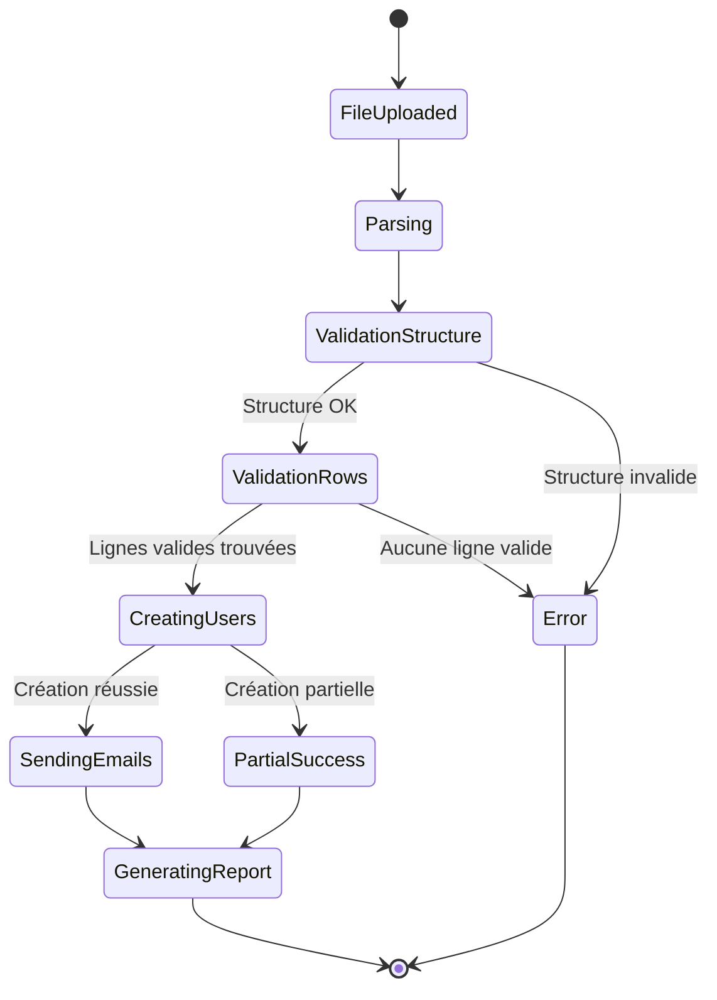

# Document de Conception

## Vue d'ensemble

Cette conception ajoute deux fonctionnalités majeures à la plateforme Lefax :

1. **Champ Matricule** : Un identifiant unique alphanumérique pour les étudiants et enseignants, unique au sein de chaque école
2. **Import en Masse** : Un système permettant aux administrateurs d'importer des utilisateurs via fichiers Excel (.xlsx) ou CSV avec validation, génération de mots de passe et rapport détaillé

Ces fonctionnalités s'intègrent dans l'architecture existante en couches de Lefax (Controllers → Services → Repositories) et utilisent TypeORM pour la persistance des données.

## Architecture

### Diagramme de Composants



### Flux d'Import en Masse



## Composants et Interfaces

### 1. Modification de l'Entité User

**Ajout du champ matricule** :

```typescript
@Entity()
export class User {
    // ... champs existants ...
    
    @Column({ nullable: true, length: 50 })
    matricule?: string;
    
    // Index unique composite pour garantir l'unicité par école
    // Défini dans la migration
}
```

**Contraintes** :
- Nullable (optionnel lors de création manuelle)
- Unique par école (index composite sur `matricule` + `school_id`)
- Longueur maximale : 50 caractères
- Format : alphanumérique uniquement

### 2. DTOs pour l'Import

**DTO de base pour l'import** :

```typescript
// dtos/import.dto.ts

export class BaseImportRowDto {
    @IsNotEmpty()
    @IsString()
    @Matches(/^[a-zA-Z0-9]+$/, { message: 'Matricule must be alphanumeric' })
    matricule!: string;

    @IsNotEmpty()
    @IsString()
    firstName!: string;

    @IsNotEmpty()
    @IsString()
    lastName!: string;

    @IsEmail()
    email!: string;

    @IsString()
    @IsOptional()
    phoneNumber?: string;
}

export class StudentImportRowDto extends BaseImportRowDto {
    @IsUUID()
    classeId!: string;
}

export class TeacherImportRowDto extends BaseImportRowDto {
    @IsString()
    matiereIds!: string; // Comma-separated UUIDs
}

export class ImportRequestDto {
    @IsEnum(['student', 'teacher'])
    userType!: 'student' | 'teacher';

    @IsBoolean()
    @IsOptional()
    sendEmail?: boolean;
}

export interface ImportError {
    row: number;
    field?: string;
    message: string;
    data?: any;
}

export interface ImportReport {
    totalRows: number;
    successCount: number;
    errorCount: number;
    duplicateCount: number;
    errors: ImportError[];
    duplicates: Array<{ row: number; field: string; value: string }>;
    createdUsers: Array<{ email: string; matricule: string }>;
}
```

### 3. FileParserService

**Responsabilité** : Parser les fichiers Excel et CSV en objets JavaScript

```typescript
// services/FileParserService.ts

export class FileParserService {
    /**
     * Parse un fichier Excel ou CSV
     * @param file - Buffer du fichier uploadé
     * @param fileType - Extension du fichier (.xlsx ou .csv)
     * @returns Array d'objets représentant les lignes
     */
    async parseFile(file: Buffer, fileType: string): Promise<any[]> {
        if (fileType === '.xlsx') {
            return this.parseExcel(file);
        } else if (fileType === '.csv') {
            return this.parseCsv(file);
        }
        throw new Error('Unsupported file type');
    }

    private async parseExcel(file: Buffer): Promise<any[]> {
        // Utilise la bibliothèque 'xlsx'
        // Lit la première feuille
        // Convertit en array d'objets
        // Retourne les données
    }

    private async parseCsv(file: Buffer): Promise<any[]> {
        // Utilise la bibliothèque 'csv-parser'
        // Parse avec délimiteur virgule
        // Retourne les données
    }

    /**
     * Valide la structure du fichier (colonnes requises)
     */
    validateFileStructure(rows: any[], userType: 'student' | 'teacher'): void {
        const requiredColumns = userType === 'student'
            ? ['matricule', 'firstName', 'lastName', 'email', 'phoneNumber', 'classeId']
            : ['matricule', 'firstName', 'lastName', 'email', 'phoneNumber', 'matiereIds'];
        
        // Vérifie que toutes les colonnes requises sont présentes
        // Lance une erreur si colonnes manquantes
    }
}
```

### 4. ImportValidationService

**Responsabilité** : Valider chaque ligne d'import

```typescript
// services/ImportValidationService.ts

export class ImportValidationService {
    constructor(
        private userRepository: Repository<User>,
        private classeRepository: Repository<Class>,
        private matiereRepository: Repository<Matiere>
    ) {}

    /**
     * Valide une ligne d'import pour un étudiant
     */
    async validateStudentRow(
        row: any,
        rowNumber: number,
        schoolId: string
    ): Promise<{ valid: boolean; errors: ImportError[]; data?: StudentImportRowDto }> {
        const errors: ImportError[] = [];

        // Validation du DTO avec class-validator
        const dto = plainToClass(StudentImportRowDto, row);
        const validationErrors = await validate(dto);
        
        if (validationErrors.length > 0) {
            // Convertir les erreurs de validation en ImportError
        }

        // Vérifier l'unicité de l'email
        const existingEmail = await this.userRepository.findOne({ where: { email: dto.email } });
        if (existingEmail) {
            errors.push({ row: rowNumber, field: 'email', message: 'Email already exists' });
        }

        // Vérifier l'unicité du matricule dans l'école
        const existingMatricule = await this.userRepository.findOne({
            where: { matricule: dto.matricule, school: { id: schoolId } }
        });
        if (existingMatricule) {
            errors.push({ row: rowNumber, field: 'matricule', message: 'Matricule already exists in this school' });
        }

        // Vérifier que la classe existe
        const classe = await this.classeRepository.findOne({ where: { id: dto.classeId } });
        if (!classe) {
            errors.push({ row: rowNumber, field: 'classeId', message: 'Class not found' });
        }

        return {
            valid: errors.length === 0,
            errors,
            data: errors.length === 0 ? dto : undefined
        };
    }

    /**
     * Valide une ligne d'import pour un enseignant
     */
    async validateTeacherRow(
        row: any,
        rowNumber: number,
        schoolId: string
    ): Promise<{ valid: boolean; errors: ImportError[]; data?: TeacherImportRowDto }> {
        const errors: ImportError[] = [];

        // Validation similaire à validateStudentRow
        // Vérifier que toutes les matières existent
        const matiereIds = row.matiereIds.split(',').map((id: string) => id.trim());
        for (const matiereId of matiereIds) {
            const matiere = await this.matiereRepository.findOne({ where: { id: matiereId } });
            if (!matiere) {
                errors.push({ row: rowNumber, field: 'matiereIds', message: `Subject ${matiereId} not found` });
            }
        }

        return {
            valid: errors.length === 0,
            errors,
            data: errors.length === 0 ? plainToClass(TeacherImportRowDto, row) : undefined
        };
    }
}
```

### 5. ImportService

**Responsabilité** : Orchestrer le processus d'import complet

```typescript
// services/ImportService.ts

export class ImportService {
    constructor(
        private fileParser: FileParserService,
        private validator: ImportValidationService,
        private userService: UserService,
        private emailService: EmailService,
        private logger: Logger
    ) {}

    /**
     * Traite un fichier d'import complet
     */
    async processImport(
        file: Express.Multer.File,
        userType: 'student' | 'teacher',
        schoolId: string,
        adminId: string,
        options: { sendEmail?: boolean } = {}
    ): Promise<ImportReport> {
        const report: ImportReport = {
            totalRows: 0,
            successCount: 0,
            errorCount: 0,
            duplicateCount: 0,
            errors: [],
            duplicates: [],
            createdUsers: []
        };

        try {
            // 1. Parser le fichier
            const fileType = path.extname(file.originalname);
            const rows = await this.fileParser.parseFile(file.buffer, fileType);
            
            // 2. Vérifier la limite de lignes
            if (rows.length > 1000) {
                throw new Error('File exceeds maximum of 1000 rows');
            }

            // 3. Valider la structure
            this.fileParser.validateFileStructure(rows, userType);
            
            report.totalRows = rows.length;

            // 4. Valider et créer les utilisateurs
            const validRows: Array<{ data: any; rowNumber: number }> = [];

            for (let i = 0; i < rows.length; i++) {
                const rowNumber = i + 2; // +2 car ligne 1 = headers, index commence à 0
                const row = rows[i];

                const validation = userType === 'student'
                    ? await this.validator.validateStudentRow(row, rowNumber, schoolId)
                    : await this.validator.validateTeacherRow(row, rowNumber, schoolId);

                if (validation.valid && validation.data) {
                    validRows.push({ data: validation.data, rowNumber });
                } else {
                    report.errorCount++;
                    report.errors.push(...validation.errors);
                }
            }

            // 5. Créer les utilisateurs dans une transaction
            await this.createUsersInTransaction(validRows, userType, schoolId, report, options);

            // 6. Logger l'opération
            this.logger.info('Import completed', {
                adminId,
                schoolId,
                userType,
                report
            });

        } catch (error) {
            this.logger.error('Import failed', { error, adminId, schoolId });
            throw error;
        }

        return report;
    }

    /**
     * Crée les utilisateurs dans une transaction
     */
    private async createUsersInTransaction(
        validRows: Array<{ data: any; rowNumber: number }>,
        userType: 'student' | 'teacher',
        schoolId: string,
        report: ImportReport,
        options: { sendEmail?: boolean }
    ): Promise<void> {
        const queryRunner = dataSource.createQueryRunner();
        await queryRunner.connect();
        await queryRunner.startTransaction();

        try {
            for (const { data, rowNumber } of validRows) {
                try {
                    // Générer un mot de passe temporaire
                    const temporaryPassword = this.generateTemporaryPassword();

                    // Créer l'utilisateur
                    const userData = {
                        ...data,
                        password: temporaryPassword,
                        role: userType === 'student' ? UserRole.ETUDIANT : UserRole.ENSEIGNANT,
                        school: { id: schoolId },
                        isVerified: false
                    };

                    if (userType === 'student') {
                        userData.classe = { id: data.classeId };
                    }

                    const user = await this.userService.createUser(userData, queryRunner);

                    // Associer les matières pour les enseignants
                    if (userType === 'teacher') {
                        const matiereIds = data.matiereIds.split(',').map((id: string) => id.trim());
                        await this.userService.assignSubjectsToTeacher(user.id, matiereIds, queryRunner);
                    }

                    report.successCount++;
                    report.createdUsers.push({
                        email: user.email,
                        matricule: user.matricule!
                    });

                    // Envoyer l'email si demandé
                    if (options.sendEmail) {
                        try {
                            await this.emailService.sendCredentials(user.email, temporaryPassword);
                        } catch (emailError) {
                            this.logger.warn('Failed to send email', { email: user.email, error: emailError });
                        }
                    }

                } catch (error) {
                    report.errorCount++;
                    report.errors.push({
                        row: rowNumber,
                        message: `Failed to create user: ${error.message}`,
                        data
                    });
                }
            }

            await queryRunner.commitTransaction();

        } catch (error) {
            await queryRunner.rollbackTransaction();
            throw error;
        } finally {
            await queryRunner.release();
        }
    }

    /**
     * Génère un mot de passe temporaire sécurisé
     */
    private generateTemporaryPassword(): string {
        // Génère un mot de passe aléatoire de 12 caractères
        // Contient majuscules, minuscules, chiffres et symboles
        const length = 12;
        const charset = 'abcdefghijklmnopqrstuvwxyzABCDEFGHIJKLMNOPQRSTUVWXYZ0123456789!@#$%^&*';
        let password = '';
        for (let i = 0; i < length; i++) {
            password += charset.charAt(Math.floor(Math.random() * charset.length));
        }
        return password;
    }
}
```

### 6. ImportController

**Responsabilité** : Gérer les requêtes HTTP d'import

```typescript
// controllers/ImportController.ts

@Controller('/api/admin/import')
export class ImportController {
    constructor(private importService: ImportService) {}

    /**
     * POST /api/admin/import/users
     * Import des utilisateurs via fichier Excel ou CSV
     */
    @Post('/users')
    @UseMiddleware(authMiddleware, roleMiddleware([UserRole.ADMIN, UserRole.SUPERADMIN]))
    @UseMiddleware(upload.single('file'))
    async importUsers(req: Request, res: Response): Promise<void> {
        try {
            const file = req.file;
            if (!file) {
                throw new AppError('No file uploaded', 400);
            }

            // Valider le type de fichier
            const allowedExtensions = ['.xlsx', '.csv'];
            const fileExtension = path.extname(file.originalname);
            if (!allowedExtensions.includes(fileExtension)) {
                throw new AppError('Invalid file type. Only .xlsx and .csv are allowed', 400);
            }

            // Valider le DTO
            const dto = plainToClass(ImportRequestDto, req.body);
            const errors = await validate(dto);
            if (errors.length > 0) {
                throw new AppError('Validation failed', 400, errors);
            }

            // Récupérer l'école de l'admin
            const admin = req.user as User;
            const schoolId = admin.school?.id;
            if (!schoolId) {
                throw new AppError('Admin must be associated with a school', 400);
            }

            // Traiter l'import
            const report = await this.importService.processImport(
                file,
                dto.userType,
                schoolId,
                admin.id,
                { sendEmail: dto.sendEmail }
            );

            res.status(200).json({
                success: true,
                message: 'Import completed',
                data: report
            });

        } catch (error) {
            if (error instanceof AppError) {
                res.status(error.statusCode).json({
                    success: false,
                    message: error.message,
                    errors: error.errors
                });
            } else {
                res.status(500).json({
                    success: false,
                    message: 'Internal server error'
                });
            }
        }
    }

    /**
     * GET /api/admin/import/template/:type
     * Télécharge un template Excel pour l'import
     */
    @Get('/template/:type')
    @UseMiddleware(authMiddleware, roleMiddleware([UserRole.ADMIN, UserRole.SUPERADMIN]))
    async downloadTemplate(req: Request, res: Response): Promise<void> {
        const { type } = req.params;

        if (!['student', 'teacher'].includes(type)) {
            throw new AppError('Invalid template type', 400);
        }

        // Générer un fichier Excel template avec les colonnes appropriées
        const workbook = new ExcelJS.Workbook();
        const worksheet = workbook.addWorksheet('Template');

        if (type === 'student') {
            worksheet.columns = [
                { header: 'matricule', key: 'matricule', width: 15 },
                { header: 'firstName', key: 'firstName', width: 20 },
                { header: 'lastName', key: 'lastName', width: 20 },
                { header: 'email', key: 'email', width: 30 },
                { header: 'phoneNumber', key: 'phoneNumber', width: 15 },
                { header: 'classeId', key: 'classeId', width: 40 }
            ];
        } else {
            worksheet.columns = [
                { header: 'matricule', key: 'matricule', width: 15 },
                { header: 'firstName', key: 'firstName', width: 20 },
                { header: 'lastName', key: 'lastName', width: 20 },
                { header: 'email', key: 'email', width: 30 },
                { header: 'phoneNumber', key: 'phoneNumber', width: 15 },
                { header: 'matiereIds', key: 'matiereIds', width: 40 }
            ];
        }

        res.setHeader('Content-Type', 'application/vnd.openxmlformats-officedocument.spreadsheetml.sheet');
        res.setHeader('Content-Disposition', `attachment; filename=import_${type}_template.xlsx`);

        await workbook.xlsx.write(res);
        res.end();
    }
}
```

### 7. Modifications du UserController

**Ajout de la gestion du matricule** :

```typescript
// controllers/UserController.ts

// Ajouter la validation du matricule dans les méthodes existantes

/**
 * PUT /api/users/:id
 * Mise à jour d'un utilisateur (incluant le matricule)
 */
async updateUser(req: Request, res: Response): Promise<void> {
    const { id } = req.params;
    const updateData = req.body;

    // Si le matricule est fourni, valider son unicité
    if (updateData.matricule) {
        const user = await this.userRepository.findOne({ where: { id }, relations: ['school'] });
        if (!user) {
            throw new AppError('User not found', 404);
        }

        // Vérifier l'unicité du matricule dans l'école
        const existingMatricule = await this.userRepository.findOne({
            where: {
                matricule: updateData.matricule,
                school: { id: user.school?.id },
                id: Not(id) // Exclure l'utilisateur actuel
            }
        });

        if (existingMatricule) {
            throw new AppError('Matricule already exists in this school', 400);
        }
    }

    // Continuer avec la mise à jour normale
    // ...
}
```

## Modèles de Données

### Schéma de Base de Données Modifié

```sql
-- Migration pour ajouter le champ matricule

ALTER TABLE user 
ADD COLUMN matricule VARCHAR(50) NULL;

-- Index unique composite pour garantir l'unicité par école
CREATE UNIQUE INDEX idx_user_matricule_school 
ON user(matricule, school_id) 
WHERE matricule IS NOT NULL;
```

### Relations



## Correctness Properties

*Une propriété est une caractéristique ou un comportement qui doit être vrai pour toutes les exécutions valides d'un système - essentiellement, une déclaration formelle sur ce que le système devrait faire. Les propriétés servent de pont entre les spécifications lisibles par l'homme et les garanties de correction vérifiables par machine.*


### Propriétés de Correction

Basé sur l'analyse prework, voici les propriétés universelles que le système doit respecter :

**Propriété 1 : Stockage du matricule pour les rôles appropriés**
*Pour tout* utilisateur avec le rôle ETUDIANT ou ENSEIGNANT, le système doit permettre de stocker et récupérer un champ matricule
**Valide : Exigences 1.1**

**Propriété 2 : Matricule optionnel lors de création manuelle**
*Pour toute* création manuelle d'utilisateur par un Admin, le système doit accepter l'absence de matricule
**Valide : Exigences 1.2**

**Propriété 3 : Validation alphanumérique du matricule**
*Pour toute* valeur de matricule fournie, le système doit accepter uniquement les chaînes alphanumériques (a-z, A-Z, 0-9) et rejeter celles contenant des caractères spéciaux ou espaces
**Valide : Exigences 1.3, 2.3, 2.4**

**Propriété 4 : Unicité du matricule par école**
*Pour tout* matricule fourni dans une école donnée, le système doit garantir qu'aucun autre utilisateur de la même école ne possède le même matricule
**Valide : Exigences 1.4, 2.1, 4.6**

**Propriété 5 : Matricule sensible à la casse**
*Pour tous* matricules, le système doit traiter "ABC123" et "abc123" comme des valeurs distinctes
**Valide : Exigences 2.5**

**Propriété 6 : Matricule identique dans différentes écoles**
*Pour tout* matricule donné, le système doit permettre à des utilisateurs d'écoles différentes d'avoir le même matricule
**Valide : Exigences 2.2**

**Propriété 7 : Modification du matricule**
*Pour tout* utilisateur existant, un Admin doit pouvoir modifier le matricule en respectant les contraintes d'unicité
**Valide : Exigences 1.6**

**Propriété 8 : Inclusion du matricule dans les réponses API**
*Pour toute* requête de liste ou profil d'utilisateur, la réponse doit inclure le champ matricule
**Valide : Exigences 1.7**

**Propriété 9 : Validation de structure de fichier étudiant**
*Pour tout* fichier d'import d'étudiants, le système doit vérifier la présence des colonnes : matricule, firstName, lastName, email, phoneNumber, classeId
**Valide : Exigences 3.3**

**Propriété 10 : Validation de structure de fichier enseignant**
*Pour tout* fichier d'import d'enseignants, le système doit vérifier la présence des colonnes : matricule, firstName, lastName, email, phoneNumber, matiereIds
**Valide : Exigences 3.4**

**Propriété 11 : Validation du matricule requis à l'import**
*Pour toute* ligne d'import, le système doit rejeter les lignes où le matricule est absent ou vide
**Valide : Exigences 4.1**

**Propriété 12 : Validation du format email**
*Pour toute* ligne d'import, le système doit valider que l'email respecte un format valide
**Valide : Exigences 4.2**

**Propriété 13 : Unicité de l'email système**
*Pour toute* ligne d'import, le système doit vérifier que l'email n'existe pas déjà dans le système
**Valide : Exigences 4.3**

**Propriété 14 : Validation de référence de classe**
*Pour toute* ligne d'import d'étudiant, le système doit vérifier que le classeId référence une classe existante
**Valide : Exigences 4.4**

**Propriété 15 : Validation de références de matières**
*Pour toute* ligne d'import d'enseignant, le système doit vérifier que tous les matiereIds référencent des matières existantes
**Valide : Exigences 4.5**

**Propriété 16 : Traitement continu malgré les erreurs**
*Pour tout* fichier d'import contenant des lignes invalides, le système doit continuer à traiter les lignes restantes
**Valide : Exigences 4.7**

**Propriété 17 : Enregistrement des erreurs avec contexte**
*Pour toute* erreur de validation sur une ligne, le système doit enregistrer le numéro de ligne et le champ concerné
**Valide : Exigences 4.8**

**Propriété 18 : Création d'utilisateur avec données complètes**
*Pour toute* ligne valide d'import, le système doit créer un utilisateur avec toutes les données fournies
**Valide : Exigences 5.1**

**Propriété 19 : Génération automatique de mot de passe**
*Pour tout* utilisateur créé via import, le système doit générer automatiquement un mot de passe temporaire
**Valide : Exigences 5.2**

**Propriété 20 : Attribution du rôle approprié**
*Pour tout* utilisateur créé via import, le système doit attribuer le rôle ETUDIANT pour les imports d'étudiants et ENSEIGNANT pour les imports d'enseignants
**Valide : Exigences 5.3**

**Propriété 21 : Association étudiant-classe**
*Pour tout* étudiant créé via import, le système doit l'associer à la classe spécifiée
**Valide : Exigences 5.4**

**Propriété 22 : Association enseignant-matières**
*Pour tout* enseignant créé via import, le système doit l'associer à toutes les matières spécifiées
**Valide : Exigences 5.5**

**Propriété 23 : Attribution de l'école de l'admin**
*Pour tout* utilisateur créé via import, le système doit l'associer à l'école de l'administrateur effectuant l'import
**Valide : Exigences 5.6**

**Propriété 24 : Traitement partiel avec succès**
*Pour tout* fichier d'import contenant des lignes valides et invalides, le système doit créer les utilisateurs pour les lignes valides uniquement
**Valide : Exigences 6.2**

**Propriété 25 : Gestion des emails dupliqués**
*Pour toute* ligne d'import avec un email dupliqué, le système doit ignorer cette ligne et l'enregistrer comme erreur
**Valide : Exigences 6.3**

**Propriété 26 : Gestion des matricules dupliqués**
*Pour toute* ligne d'import avec un matricule dupliqué dans l'école, le système doit ignorer cette ligne et l'enregistrer comme erreur
**Valide : Exigences 6.4**

**Propriété 27 : Journalisation des imports**
*Pour toute* opération d'import, le système doit créer un log contenant l'horodatage, l'identifiant de l'admin et le nom du fichier
**Valide : Exigences 6.5**

**Propriété 28 : Complétude du rapport d'import**
*Pour toute* opération d'import, le rapport généré doit contenir : le nombre total de lignes, le nombre de succès, le nombre d'erreurs, la liste des erreurs avec numéros de ligne, et la liste des doublons détectés
**Valide : Exigences 7.1, 7.2, 7.3, 7.4, 7.5, 7.6, 7.7**

**Propriété 29 : Envoi d'email optionnel**
*Pour tout* utilisateur créé via import lorsque l'envoi d'email est activé, le système doit envoyer un email contenant l'adresse email et le mot de passe temporaire
**Valide : Exigences 8.1, 8.2**

**Propriété 30 : Résilience aux échecs d'email**
*Pour tout* échec d'envoi d'email lors d'un import, le système doit enregistrer l'échec dans le rapport mais continuer le traitement
**Valide : Exigences 8.4**

**Propriété 31 : Restriction d'accès aux admins**
*Pour toute* tentative d'opération sur les matricules ou d'import, le système doit vérifier que l'utilisateur a le rôle ADMIN ou SUPERADMIN
**Valide : Exigences 9.1, 9.2**

**Propriété 32 : Validation du token d'authentification**
*Pour toute* opération d'import ou de modification de matricule, le système doit valider le token d'authentification de l'admin
**Valide : Exigences 9.5**

## Gestion des Erreurs

### Types d'Erreurs

1. **Erreurs de Validation**
   - Format de matricule invalide → 400 Bad Request
   - Matricule dupliqué dans l'école → 400 Bad Request
   - Email invalide ou dupliqué → 400 Bad Request
   - Référence invalide (classe, matière) → 400 Bad Request

2. **Erreurs d'Autorisation**
   - Token invalide ou expiré → 401 Unauthorized
   - Rôle insuffisant → 403 Forbidden

3. **Erreurs de Fichier**
   - Type de fichier non supporté → 400 Bad Request
   - Fichier trop volumineux (>1000 lignes) → 400 Bad Request
   - Structure de fichier invalide → 400 Bad Request

4. **Erreurs de Base de Données**
   - Erreur de transaction → 500 Internal Server Error + Rollback
   - Contrainte d'unicité violée → 400 Bad Request

### Stratégie de Gestion

```typescript
// Exemple de gestion d'erreur dans le controller

try {
    const report = await this.importService.processImport(...);
    res.status(200).json({ success: true, data: report });
} catch (error) {
    if (error instanceof AppError) {
        res.status(error.statusCode).json({
            success: false,
            message: error.message,
            errors: error.errors
        });
    } else {
        this.logger.error('Unexpected error', { error });
        res.status(500).json({
            success: false,
            message: 'Internal server error'
        });
    }
}
```

### Rollback et Transactions

- Toutes les créations d'utilisateurs lors d'un import sont effectuées dans une transaction unique
- En cas d'erreur critique (base de données, système), rollback complet
- En cas d'erreurs de validation individuelles, seules les lignes valides sont créées
- Les erreurs d'envoi d'email ne déclenchent pas de rollback

## Stratégie de Test

### Approche Duale de Test

Le système utilise une approche combinant tests unitaires et tests basés sur les propriétés :

- **Tests unitaires** : Vérifient des exemples spécifiques, cas limites et conditions d'erreur
- **Tests basés sur propriétés** : Vérifient les propriétés universelles sur tous les inputs

Les deux approches sont complémentaires et nécessaires pour une couverture complète.

### Tests Basés sur Propriétés

**Configuration** :
- Bibliothèque : `fast-check` (pour TypeScript/JavaScript)
- Minimum 100 itérations par test de propriété
- Chaque test doit référencer sa propriété du document de conception
- Format de tag : **Feature: user-matricule-and-bulk-import, Property {number}: {property_text}**

**Exemples de Tests de Propriétés** :

```typescript
// Test de la Propriété 3 : Validation alphanumérique
describe('Feature: user-matricule-and-bulk-import, Property 3: Alphanumeric validation', () => {
    it('should accept only alphanumeric matricules', async () => {
        await fc.assert(
            fc.asyncProperty(
                fc.string({ minLength: 1, maxLength: 50 }),
                async (matricule) => {
                    const isAlphanumeric = /^[a-zA-Z0-9]+$/.test(matricule);
                    const result = await validateMatricule(matricule);
                    
                    if (isAlphanumeric) {
                        expect(result.valid).toBe(true);
                    } else {
                        expect(result.valid).toBe(false);
                        expect(result.error).toContain('alphanumeric');
                    }
                }
            ),
            { numRuns: 100 }
        );
    });
});

// Test de la Propriété 4 : Unicité par école
describe('Feature: user-matricule-and-bulk-import, Property 4: Uniqueness per school', () => {
    it('should enforce matricule uniqueness within a school', async () => {
        await fc.assert(
            fc.asyncProperty(
                fc.record({
                    matricule: fc.string({ minLength: 1, maxLength: 50 }).filter(s => /^[a-zA-Z0-9]+$/.test(s)),
                    schoolId: fc.uuid(),
                    user1: fc.record({ firstName: fc.string(), lastName: fc.string(), email: fc.emailAddress() }),
                    user2: fc.record({ firstName: fc.string(), lastName: fc.string(), email: fc.emailAddress() })
                }),
                async ({ matricule, schoolId, user1, user2 }) => {
                    // Créer le premier utilisateur
                    const firstUser = await createUser({ ...user1, matricule, schoolId });
                    expect(firstUser).toBeDefined();
                    
                    // Tenter de créer un second utilisateur avec le même matricule
                    await expect(
                        createUser({ ...user2, matricule, schoolId })
                    ).rejects.toThrow('Matricule already exists');
                }
            ),
            { numRuns: 100 }
        );
    });
});

// Test de la Propriété 28 : Complétude du rapport
describe('Feature: user-matricule-and-bulk-import, Property 28: Complete import report', () => {
    it('should generate complete import reports', async () => {
        await fc.assert(
            fc.asyncProperty(
                fc.array(
                    fc.record({
                        matricule: fc.string({ minLength: 1, maxLength: 50 }),
                        firstName: fc.string(),
                        lastName: fc.string(),
                        email: fc.emailAddress(),
                        phoneNumber: fc.string(),
                        classeId: fc.uuid()
                    }),
                    { minLength: 1, maxLength: 100 }
                ),
                async (rows) => {
                    const report = await processImport(rows, 'student');
                    
                    // Vérifier que le rapport contient tous les champs requis
                    expect(report).toHaveProperty('totalRows');
                    expect(report).toHaveProperty('successCount');
                    expect(report).toHaveProperty('errorCount');
                    expect(report).toHaveProperty('duplicateCount');
                    expect(report).toHaveProperty('errors');
                    expect(report).toHaveProperty('duplicates');
                    expect(report).toHaveProperty('createdUsers');
                    
                    // Vérifier la cohérence des nombres
                    expect(report.totalRows).toBe(rows.length);
                    expect(report.successCount + report.errorCount).toBe(report.totalRows);
                }
            ),
            { numRuns: 100 }
        );
    });
});
```

### Tests Unitaires

**Cas Spécifiques à Tester** :

1. **Matricule**
   - Création d'utilisateur sans matricule (optionnel)
   - Mise à jour du matricule d'un utilisateur existant
   - Erreur 403 pour utilisateur non-admin tentant de modifier un matricule

2. **Import de Fichiers**
   - Upload de fichier .xlsx valide
   - Upload de fichier .csv valide
   - Rejet de fichier avec extension invalide
   - Rejet de fichier dépassant 1000 lignes
   - Rejet de fichier avec colonnes manquantes

3. **Validation d'Import**
   - Ligne avec email invalide
   - Ligne avec classeId inexistant
   - Ligne avec matiereIds inexistants
   - Fichier mixte (lignes valides et invalides)

4. **Rapport d'Import**
   - Import 100% réussi
   - Import avec erreurs partielles
   - Import avec doublons détectés

5. **Email**
   - Envoi d'email activé
   - Envoi d'email désactivé
   - Échec d'envoi d'email (ne bloque pas l'import)

6. **Sécurité**
   - Accès refusé pour utilisateur non-authentifié
   - Accès refusé pour utilisateur avec rôle USER/ETUDIANT/ENSEIGNANT
   - Accès autorisé pour ADMIN/SUPERADMIN

7. **Migration**
   - Exécution de la migration
   - Rollback de la migration
   - Préservation des données existantes

### Couverture de Test

**Objectifs** :
- Couverture de code : >80%
- Toutes les propriétés de correction doivent avoir un test basé sur propriété
- Tous les cas limites doivent avoir un test unitaire
- Tous les chemins d'erreur doivent être testés

**Outils** :
- Framework de test : Jest
- Property-based testing : fast-check
- Mocking : jest.mock pour les dépendances externes
- Coverage : jest --coverage

## Considérations de Sécurité

### Authentification et Autorisation

1. **Middleware d'authentification** : Vérification du JWT sur toutes les routes protégées
2. **Middleware de rôle** : Restriction aux rôles ADMIN et SUPERADMIN
3. **Validation du contexte école** : L'admin doit être associé à une école

### Validation des Données

1. **Sanitization** : Nettoyage des inputs pour prévenir les injections
2. **Validation stricte** : Utilisation de class-validator pour tous les DTOs
3. **Limite de taille** : Maximum 1000 lignes par fichier d'import
4. **Types de fichiers** : Restriction aux extensions .xlsx et .csv uniquement

### Protection des Données Sensibles

1. **Mots de passe** : Hachage avec bcrypt avant stockage
2. **Logs** : Ne jamais logger les mots de passe ou tokens
3. **Emails** : Envoi sécurisé via service d'email configuré
4. **Transactions** : Isolation des opérations d'import par école

### Audit et Traçabilité

1. **Logs d'import** : Enregistrement de toutes les opérations avec timestamp et admin
2. **Logs d'erreurs** : Enregistrement détaillé des échecs
3. **Rapport d'import** : Traçabilité complète de chaque opération

## Performance et Scalabilité

### Optimisations

1. **Batch Processing** : Traitement par lots pour les imports volumineux
2. **Transactions** : Utilisation de transactions pour garantir l'atomicité
3. **Indexation** : Index composite sur (matricule, school_id) pour les recherches rapides
4. **Validation asynchrone** : Validation parallèle des lignes d'import

### Limites

1. **Taille de fichier** : Maximum 1000 lignes par import
2. **Timeout** : Timeout de 5 minutes pour les opérations d'import
3. **Rate limiting** : Limitation du nombre d'imports par admin (ex: 10 par heure)

### Monitoring

1. **Métriques** : Temps de traitement, taux de succès, taux d'erreur
2. **Alertes** : Notification en cas d'échec critique
3. **Logs structurés** : Logs JSON pour faciliter l'analyse

## Dépendances

### Bibliothèques Requises

```json
{
  "dependencies": {
    "xlsx": "^0.18.5",
    "csv-parser": "^3.0.0",
    "class-validator": "^0.14.0",
    "class-transformer": "^0.5.1",
    "bcrypt": "^5.1.1",
    "exceljs": "^4.3.0"
  },
  "devDependencies": {
    "fast-check": "^3.15.0",
    "@types/jest": "^29.5.0",
    "jest": "^29.5.0"
  }
}
```

### Services Externes

1. **Service d'email** : Pour l'envoi des identifiants (ex: SendGrid, AWS SES)
2. **Base de données** : MySQL avec TypeORM
3. **Stockage temporaire** : Pour les fichiers uploadés (système de fichiers ou S3)

## Migration et Déploiement

### Migration de Base de Données

```typescript
// migrations/XXXXXX-AddMatriculeToUser.ts

import { MigrationInterface, QueryRunner, TableColumn, TableIndex } from "typeorm";

export class AddMatriculeToUser1234567890 implements MigrationInterface {
    public async up(queryRunner: QueryRunner): Promise<void> {
        // Ajouter la colonne matricule
        await queryRunner.addColumn('user', new TableColumn({
            name: 'matricule',
            type: 'varchar',
            length: '50',
            isNullable: true
        }));

        // Créer l'index unique composite
        await queryRunner.createIndex('user', new TableIndex({
            name: 'IDX_USER_MATRICULE_SCHOOL',
            columnNames: ['matricule', 'school_id'],
            isUnique: true,
            where: 'matricule IS NOT NULL'
        }));
    }

    public async down(queryRunner: QueryRunner): Promise<void> {
        // Supprimer l'index
        await queryRunner.dropIndex('user', 'IDX_USER_MATRICULE_SCHOOL');

        // Supprimer la colonne
        await queryRunner.dropColumn('user', 'matricule');
    }
}
```

### Étapes de Déploiement

1. **Backup de la base de données**
2. **Exécution de la migration** : `npm run migration:run`
3. **Déploiement du code** : Mise à jour de l'application
4. **Tests de fumée** : Vérification des endpoints critiques
5. **Monitoring** : Surveillance des logs et métriques

### Rollback

En cas de problème :
1. **Rollback du code** : Retour à la version précédente
2. **Rollback de la migration** : `npm run migration:revert`
3. **Restauration du backup** : Si nécessaire

## Documentation API

### Endpoints

#### POST /api/admin/import/users

Importe des utilisateurs via fichier Excel ou CSV.

**Authentification** : Requise (ADMIN ou SUPERADMIN)

**Request** :
```
Content-Type: multipart/form-data

file: [fichier .xlsx ou .csv]
userType: "student" | "teacher"
sendEmail: boolean (optionnel, défaut: false)
```

**Response 200** :
```json
{
  "success": true,
  "message": "Import completed",
  "data": {
    "totalRows": 50,
    "successCount": 48,
    "errorCount": 2,
    "duplicateCount": 1,
    "errors": [
      {
        "row": 5,
        "field": "email",
        "message": "Email already exists"
      }
    ],
    "duplicates": [
      {
        "row": 10,
        "field": "matricule",
        "value": "ETU001"
      }
    ],
    "createdUsers": [
      {
        "email": "user1@example.com",
        "matricule": "ETU001"
      }
    ]
  }
}
```

**Response 400** :
```json
{
  "success": false,
  "message": "Invalid file type. Only .xlsx and .csv are allowed"
}
```

**Response 403** :
```json
{
  "success": false,
  "message": "Forbidden: Insufficient permissions"
}
```

#### GET /api/admin/import/template/:type

Télécharge un template Excel pour l'import.

**Authentification** : Requise (ADMIN ou SUPERADMIN)

**Paramètres** :
- `type` : "student" ou "teacher"

**Response** : Fichier Excel avec les colonnes appropriées

#### PUT /api/users/:id

Met à jour un utilisateur (incluant le matricule).

**Authentification** : Requise (ADMIN ou SUPERADMIN)

**Request** :
```json
{
  "firstName": "Jean",
  "lastName": "Dupont",
  "matricule": "ETU001",
  "email": "jean.dupont@example.com"
}
```

**Response 200** :
```json
{
  "success": true,
  "data": {
    "id": "uuid",
    "firstName": "Jean",
    "lastName": "Dupont",
    "matricule": "ETU001",
    "email": "jean.dupont@example.com",
    "role": "etudiant"
  }
}
```

## Diagrammes Supplémentaires

### Diagramme de Séquence - Validation d'Import



### Diagramme d'État - Processus d'Import



## Conclusion

Cette conception fournit une solution complète pour l'ajout du champ matricule et l'import en masse d'utilisateurs dans la plateforme Lefax. Elle s'intègre harmonieusement dans l'architecture existante en couches, respecte les principes de sécurité et de validation, et offre une expérience robuste avec gestion d'erreurs détaillée et rapports complets.

Les propriétés de correction définies garantissent que le système se comporte correctement dans tous les cas d'usage, et la stratégie de test duale (unitaire + basée sur propriétés) assure une couverture complète et une confiance élevée dans la qualité du code.
