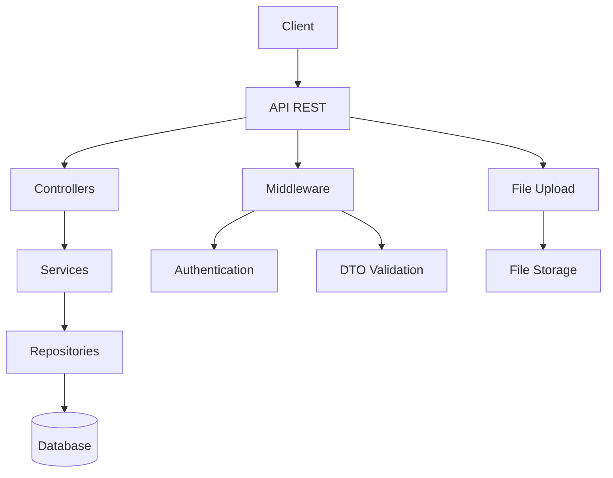
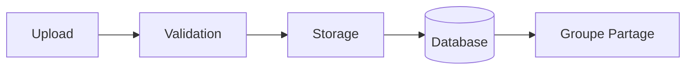
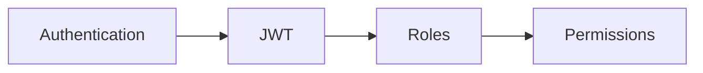
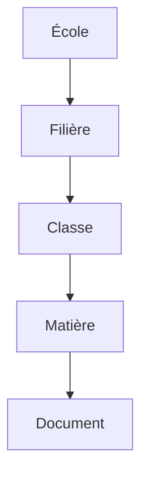
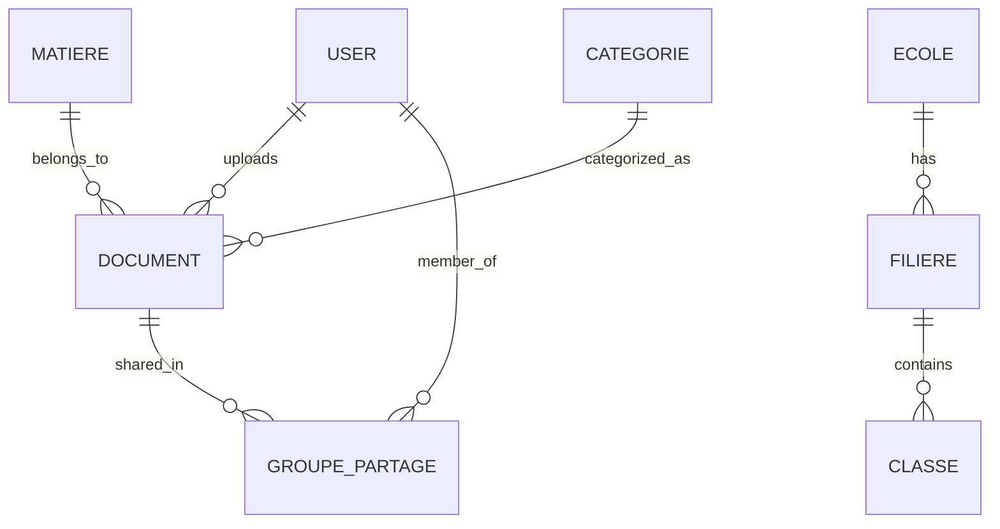
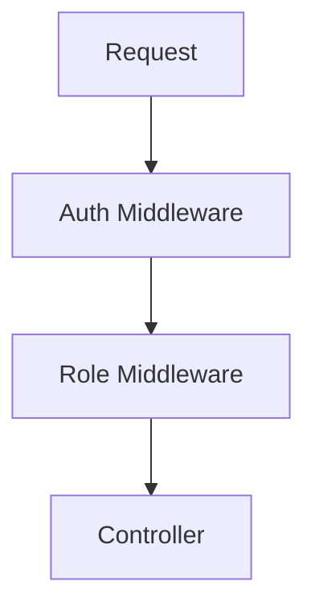
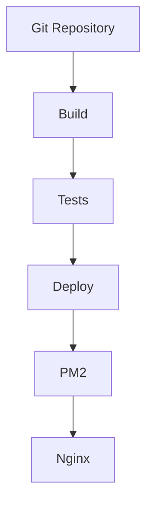

# Architecture

## Vue d'ensemble

Lefax suit une architecture en couches basée sur les principes REST et utilise TypeScript pour assurer la sécurité des types.

## Diagramme d'architecture



## Couches de l'application

### 1. Controllers (src/controllers/)
- Gestion des requêtes HTTP
- Validation des entrées
- Formatage des réponses
- Gestion des erreurs

### 2. Services (src/services/)
- Logique métier
- Orchestration des opérations
- Transactions
- Validation métier

### 3. Repositories (via TypeORM)
- Accès aux données
- Requêtes SQL
- Relations entre entités
- Cache de données

### 4. Entities (src/entity/)
- Modèles de données
- Relations
- Validation
- Hooks TypeORM

## Composants principaux

### Gestion des documents


### Gestion des utilisateurs


### Organisation pédagogique


## Base de données

### Schéma relationnel


## Sécurité

### Authentification
- JWT pour l'authentification stateless
- Refresh tokens pour la persistance
- Validation des rôles par middleware

### Autorisation


### Validation des données
- DTOs avec class-validator
- Middleware de validation
- Sanitization des entrées

## Gestion des fichiers

### Upload
- Multer pour la gestion des fichiers
- Validation des types MIME
- Limitation de taille
- Stockage sécurisé

### Organisation
```
uploads/
├── documents/
│   ├── [date]/
│   │   └── [uuid].[ext]
└── temp/
```

## Cache et Performance

### Stratégies de cache
- Cache des requêtes fréquentes
- Cache des résultats de recherche
- Cache des documents populaires

### Optimisations
- Pagination des résultats
- Lazy loading des relations
- Indexation des recherches

## Monitoring et Logs

### Métriques collectées
- Temps de réponse API
- Utilisation mémoire/CPU
- Taux d'erreurs
- Statistiques d'utilisation

### Logs
- Logs d'accès
- Logs d'erreurs
- Logs d'audit
- Logs de performance

## Déploiement

### Production


### Environnements
- Développement
- Staging
- Production

## Extensibilité

### Points d'extension
- Middlewares personnalisés
- Nouveaux types de documents
- Plugins de validation
- Intégrations externes